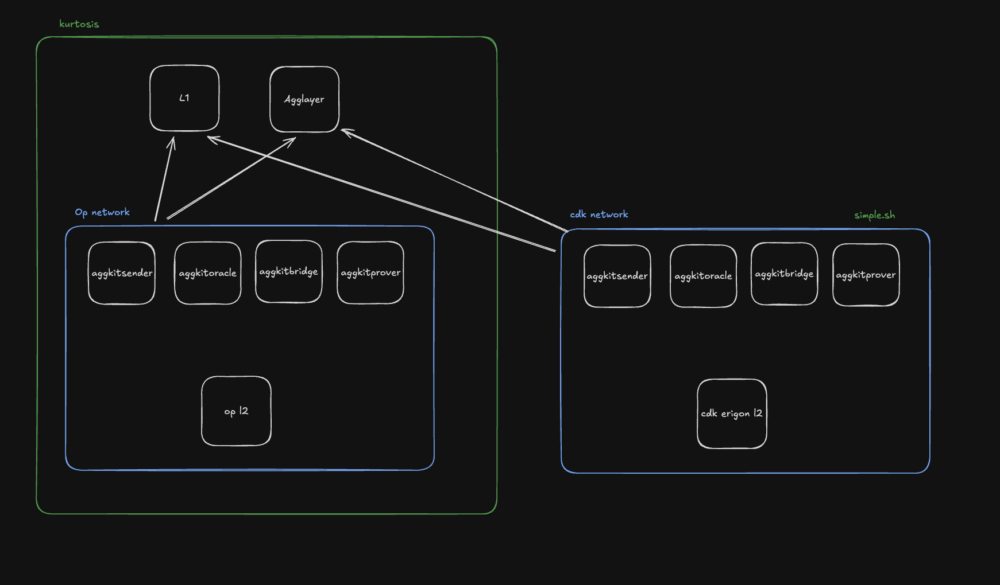

# Miden AggLayer integration

## Development

### Prerequisites

In addition to a Rust IDE the following software is required:

* [OrbStack](https://orbstack.dev)
* [node](https://nodejs.org)
* [kurtosis](https://www.kurtosis.com)
* [foundry](https://getfoundry.sh)
* [polycli](https://github.com/0xPolygon/polygon-cli)
* cdk-erigon sovereign-fep Docker image

### cdk-erigon sovereign-fep Docker image

How to obtain a `cdk-erigon:local` Docker image for
`simple.sh` calling `kurtosis-cdk/sovereign-fep/cdk-erigon.yaml`

    git clone https://github.com/0xPolygon/cdk-erigon
    cd cdk-erigon
    git checkout feat/sovereign-fep

Modify Dockerfile adding `disable_libutp`:
```   
-    make BUILD_TAGS=nosqlite,noboltdb,nosilkworm all
+    make BUILD_TAGS=nosqlite,noboltdb,nosilkworm,disable_libutp all
```

Build:

    docker build -t cdk-erigon:local --file Dockerfile .

### Setup

The development Docker cluster configuration is in the `project/erigon-fep` branch
of [this kurtosis-cdk fork](https://github.com/gateway-fm/kurtosis-cdk/tree/project/erigon-fep):

    git clone https://github.com/gateway-fm/kurtosis-cdk
    cd kurtosis-cdk
    git checkout project/erigon-fep

It can be spawned with the following commands:

    kurtosis run --enclave=cdk --args-file=./.github/tests/op-succinct/mock-prover.yml .
    cd sovereign-fep
    ./simple.sh

This produces a set of L1, L2 and AggLayer components:



It has 2 L2s connected to the same L1 using AggLayer:
1. "OP L2" - is part of the kurtosis "cdk" enclave. It is unused at the moment.
2. "cdk erigon L2" - is a part of the "sovereign-fep" Docker compose group. This L2 represents Miden and used by the tests.

### Cleanup on reboot/errors

In case of errors or after a reboot the safest is to cleanup the cluster containers:

    kurtosis clean --all
    docker rm -f $(docker ps -aq --filter "label=com.docker.compose.project=sovereign-fep")

and then rerun the setup commands from scratch.

### L1 to Miden bridging local test

Start a local Miden node:

    make start-node

Run the miden-agglayer service in IDE or CLI:

    make build
    ./target/release/miden-agglayer

Having it running:

    ./scripts/deposit.sh    # deposit tokens on L1 for bridging
    ./scripts/claim.sh <N>  # sends a claim transaction on Miden

### Canned HTTP tests

[test_requests.http](src/test_requests.http) canned HTTP requests can be run from within RustRover against the running service.
