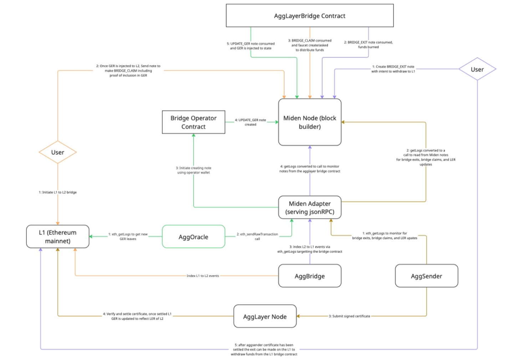

# Miden AggLayer integration

## Development

### Prerequisites

In addition to a Rust IDE the following software is required:

* [OrbStack](https://orbstack.dev)
* [node](https://nodejs.org)
* [kurtosis](https://www.kurtosis.com)
* [foundry](https://getfoundry.sh)
* [polycli](https://github.com/0xPolygon/polygon-cli)
* [miden-node](https://github.com/0xMiden/miden-node)
* [miden-client](https://github.com/0xMiden/miden-client)
* [aggkit-proxy](https://github.com/mandrigin/aggkit-proxy)

### Setup Kurtosis enclave

The development Kurtosis enclave configuration is in the `aggkit-proxy` project.

It requires:
1. `miden-node` Docker image. It can be built from the `aggkit-proxy` checkout directory:

        docker build -t miden-infra/miden-node:agglayer-v0.1 -f Dockerfile.miden-node .

1. this `miden-agglayer` service Docker image:

        make docker

The enclave can be spawned with the following commands:

    cd kurtosis/miden-cdk
    kurtosis run --enclave=miden-cdk --args-file=params.yaml .

This produces a set of L1, L2 and AggLayer containers.

In case of errors or after a reboot the safest is to clean up the enclave containers:

    kurtosis clean --all

and then rerun the enclave from scratch.

### L1 to Miden bridging local test

Prepare the `miden-client` CLI once - build, init config and create a wallet:

    git clone https://github.com/0xMiden/miden-client
    cd miden-client
    git checkout exp-agglayer-v0.2.2
    cargo build --release --bin miden-client
    ./target/release/miden-client init --network http://$(kurtosis port print miden-cdk miden-node-001 rpc)
    ./target/release/miden-client new-wallet

Remember the wallet account ID (`$acc_id`) for the next commands.

By default, a `miden-agglayer` service instance is running inside the enclave. It can be stopped: 

    docker container stop $(docker ps -q --filter 'name=miden-proxy-001')

When stopped, the `miden-l2-forwarder` (nginx) is going to look for an instance on localhost.

Run the miden-agglayer service in IDE or CLI:

    make build
    ./target/release/miden-agglayer-service --miden-node http://$(kurtosis port print miden-cdk miden-node-001 rpc)

Having it running:

    ./scripts/deposit.sh $acc_id

This will deposit tokens on L1 for bridging, wait until the L1 block is finalized (ready_for_claim).
That in turn triggers an automatic claim manager to call the `miden-agglayer` service,
submit to the `miden-node` and generate a P2ID note for our wallet.

That P2ID note needs to be "consumed" for the tokens to appear on the wallet:

    cd ../miden-client/target/release
    ./miden-client sync
    ./miden-client consume-notes -a $acc_id
    ./miden-client account -s $acc_id | grep -A5 Assets

### Canned HTTP tests

[test_requests.http](src/test_requests.http) canned HTTP requests can be run from within RustRover against the running service.

This doesn't need Kurtosis and only requires a local Miden node.
If `miden-node` is checked out and built in the parent directory, a local node can be spawned using:

    make node

### Architecture

### CI checks

Before committing run:

    make fmt lint

This requires several cargo tools:

    make install-tools

### Known issues

* debug build panics after claim during sync with "attempt to subtract with overflow" DatabaseError, see: https://github.com/0xMiden/crypto/issues/828 
* `aggkit-001` container logs errors during GER insertion "failed to add tx to get monitored: already exists", see: https://github.com/agglayer/aggkit/issues/1479
* only supports fixed faucets from the config file, waiting to implement a faucet registry
* GER insertion is mocked, not forwarded to Miden
* ClaimEvent is produced after the 1st ClaimNote service transaction succeeds. It must be delayed to wait for the NTX builder's 2nd transaction on the faucet to succeed (and produce P2ID) or fail.  
* AggSender is not configured, L2-to-L1 flow not ready
