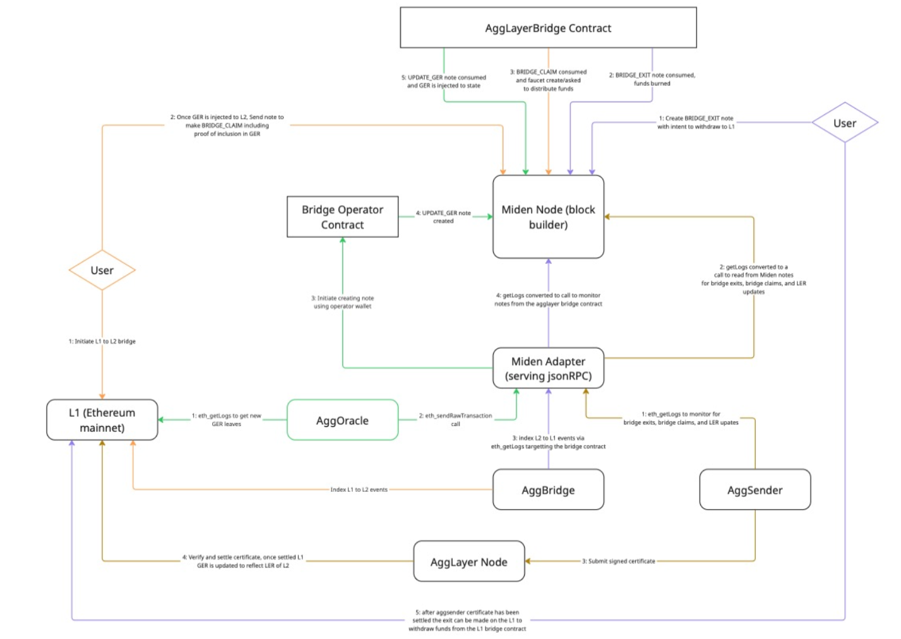

# miden-agglayer

Bridges Polygon AggLayer (EVM L1) to Miden (ZK rollup). Exposes a JSON-RPC interface mimicking an EVM node, translates EVM transactions into Miden notes (CLAIM, GER, B2AGG), and manages bidirectional bridging state.



## How it works

The service sits between the AggLayer tooling (aggoracle, aggsender, bridge-service) and a Miden node. It:

1. **Accepts standard EVM JSON-RPC calls** (`eth_sendRawTransaction`, `eth_getLogs`, `eth_call`, etc.)
2. **Translates bridge operations** into Miden transactions:
   - `claimAsset()` → CLAIM note (L1 deposit arrives on Miden)
   - `insertGlobalExitRoot()` → GER update note (exit root sync)
   - B2AGG note scanning → `BridgeEvent` log (Miden withdrawal reaches L1)
3. **Maintains synthetic EVM state** (block numbers, logs, receipts) so AggLayer components see a familiar EVM chain
4. **Runs background tasks**: `ClaimSettler` auto-claims settled deposits on L1, `BridgeOutScanner` detects Miden withdrawals

### Module structure

```
src/
├── service.rs              # JSON-RPC router + dispatch (~300 lines)
├── service_send_raw_txn.rs # claimAsset / insertGlobalExitRoot processing
├── service_eth_call.rs     # eth_call handler + L1 forwarding
├── service_get_logs.rs     # eth_getLogs with LogFilter
├── service_get_txn_receipt.rs
├── service_debug.rs        # debug_traceTransaction
├── service_zkevm.rs        # zkevm_getLatestGlobalExitRoot, zkevm_getExitRootsByGER
├── service_helpers.rs      # Shared helpers, sol! macros, error types
├── service_state.rs        # ServiceState (shared state for all handlers)
├── store/
│   ├── mod.rs              # Store trait (~25 async methods)
│   ├── memory.rs           # InMemoryStore (default, used in tests)
│   ├── postgres.rs         # PgStore (production, --features postgres)
│   └── postgres_tests.rs   # PgStore integration tests
├── l1_client.rs            # L1Client trait + AlloyL1Client + NoOpL1Client
├── miden_client.rs         # MidenClient (dedicated thread, MPSC channel)
├── claim.rs                # publish_claim (CLAIM note creation)
├── claim_settler.rs        # Background L2→L1 auto-claiming
├── ger.rs                  # GER insertion + L1 exit root fetching
├── bridge_out.rs           # BridgeOutScanner (B2AGG note → BridgeEvent)
├── restore.rs              # Disaster recovery (--restore flag)
├── metrics.rs              # Prometheus metrics + /health endpoint
├── amount.rs               # ETH↔Miden decimal scaling (18 vs 8 decimals)
├── address_mapper.rs       # ETH address → Miden AccountId derivation
└── main.rs                 # CLI entry point (clap)
```

## Prerequisites

- [Rust](https://rustup.rs) (1.90+, nightly for Docker builds)
- [Docker](https://docs.docker.com/get-docker/) + Docker Compose (for E2E tests)
- [Foundry](https://getfoundry.sh) (`cast` CLI, for E2E tests)

Optional dev tools (install with `make install-tools`):

- `cargo-nextest` (faster test runner)
- `taplo` (TOML formatting)
- `typos-cli` (spell checker)

## Quick start

```bash
# Build
make build

# Run (connects to a local miden-node)
./target/debug/miden-agglayer-service \
    --miden-node http://localhost:57291 \
    --port 8546
```

### CLI flags

| Flag | Env var | Default | Description |
|------|---------|---------|-------------|
| `--port` | | `8546` | JSON-RPC HTTP port |
| `--miden-node` | | `http://localhost:57291` | Miden node gRPC URL (or `devnet`/`testnet`) |
| `--miden-store-dir` | | `$HOME/.miden` | Directory for miden-client data |
| `--chain-id` | `CHAIN_ID` | `2` | EVM chain ID for `eth_chainId` |
| `--network-id` | `NETWORK_ID` | `1` | Rollup network ID from RollupManager |
| `--l1-rpc-url` | `L1_RPC_URL` | | L1 RPC URL (enables GER verification + claim forwarding) |
| `--database-url` | `DATABASE_URL` | | PostgreSQL URL (enables PgStore; omit for InMemoryStore) |
| `--bridge-address` | `BRIDGE_ADDRESS` | | L1 bridge contract address |
| `--l1-ger-address` | `L1_GER_ADDRESS` | `0x1f7a...2674` | L1 GER contract address |
| `--rollup-manager-address` | `ROLLUP_MANAGER_ADDRESS` | `0x6c6c...da43` | RollupManager (eth_call forwarding) |
| `--rollup-address` | `ROLLUP_ADDRESS` | `0x414e...0e4e` | Rollup contract (eth_call forwarding) |
| `--restore` | | | Reconstruct store from miden-node + L1, then exit |
| `--init` | | | Initialize accounts config, then exit |

### ClaimSettler env vars

| Env var | Description |
|---------|-------------|
| `CLAIM_SETTLER_ENABLED` | `true` to enable background L2→L1 claiming |
| `CLAIM_SETTLER_PRIVATE_KEY` | Private key for signing L1 claim transactions |
| `BRIDGE_SERVICE_URL` | Bridge-service REST API (default: `http://bridge-service:8080`) |
| `CLAIM_SETTLER_WATCH_ADDRESSES` | Comma-separated addresses to watch (default: signer address) |

## Testing

### Run everything

```bash
make test
```

This runs unit tests, then spins up the full docker-compose stack (Anvil, Miden node, PostgreSQL, bridge-service, AggLayer, AggKit), runs both L1→L2 and L2→L1 E2E tests with exact balance assertions, and tears everything down.

### Individual targets

```bash
# Unit tests only (fast, no docker)
make test-unit

# E2E only — spins up stack, tests, tears down
make test-e2e

# Individual E2E directions (spins up stack if needed)
make e2e-l1-to-l2        # Deposit on L1, verify exact L2 balance
make e2e-l2-to-l1        # Bridge out from L2, verify exact L1 balance delta

# Disaster recovery test
make e2e-restore          # Populate → wipe PG → restore → verify

# PgStore integration tests (needs running PostgreSQL)
DATABASE_URL=postgres://... make test-postgres

# Manage the E2E stack manually
make e2e-up               # Start stack
make e2e-down             # Tear down stack
make e2e-logs             # Tail all service logs
```

### What the E2E tests verify

**L1→L2 (`e2e-l1-to-l2.sh`):**
1. Deposits `10^13 wei` on L1 via `bridgeAsset()`
2. Waits for bridge-service to detect the deposit as `ready_for_claim`
3. Waits for ClaimTxManager to auto-submit a CLAIM note
4. Waits for CLAIM to commit on Miden
5. Asserts the L2 wallet balance equals **exactly 1000 Miden units** (`10^13 / 10^10`)

**L2→L1 (`e2e-l2-to-l1.sh`):**
1. Creates a B2AGG bridge-out note on Miden (half the wallet balance)
2. Waits for `BridgeEvent` to appear in L2 proxy logs
3. Waits for AggLayer certificate settlement
4. Waits for ClaimSettler auto-claim on L1
5. Asserts the L1 balance delta equals **exactly `bridge_amount * 10^10` wei**

Both tests fail immediately on any balance mismatch.

### Docker-compose stack

The E2E environment (`docker-compose.e2e.yml`) runs:

| Service | Image | Port | Purpose |
|---------|-------|------|---------|
| `anvil` | foundry | 8545 | L1 EVM chain with pre-deployed bridge contracts |
| `miden-node` | miden-node | 57291 | Miden ZK rollup node |
| `miden-agglayer` | (built from repo) | 8546 | Service under test |
| `agglayer-postgres` | postgres:16 | 5434 | miden-agglayer PgStore |
| `postgres` | postgres:16 | 5433 | bridge-service database |
| `bridge-service` | zkevm-bridge-service | 18080 | Polygon bridge REST API |
| `agglayer` | agglayer | 4443 | AggLayer certificate aggregation |
| `aggkit` | aggkit | 5576 | aggoracle + aggsender |

### Observability

The service exposes:
- `GET /health` — returns `{"status": "ok"}`
- `GET /metrics` — Prometheus metrics (request counts by method, latencies, claims/GERs/bridge-outs processed)

## Development

```bash
make check         # cargo check
make fmt           # Format Rust + TOML
make lint          # format-check + toml-check + typos-check + clippy
make lint-fix      # Auto-fix lint issues
make doc           # Generate docs
make install-tools # Install dev tools (nextest, taplo, typos)
```

### Database

With `--database-url` / `DATABASE_URL`, the service uses PostgreSQL instead of the in-memory store. Apply the schema:

```bash
psql $DATABASE_URL -f migrations/001_initial.sql
```

The docker-compose E2E stack handles this automatically via the `agglayer-migrate` service.

### Disaster recovery

If the PostgreSQL store is lost, reconstruct state from authoritative sources:

```bash
./target/release/miden-agglayer-service \
    --miden-node http://... \
    --l1-rpc-url http://... \
    --database-url postgres://... \
    --bridge-address 0x... \
    --restore
```

This scans the Miden node and L1 to rebuild claims, bridge-outs, GER entries, and synthetic logs.
