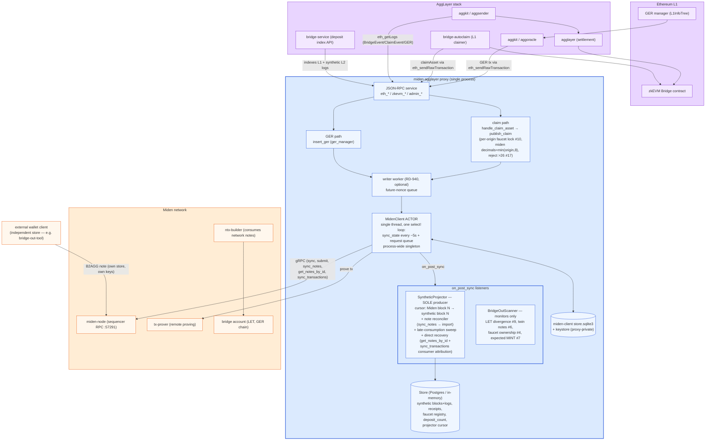
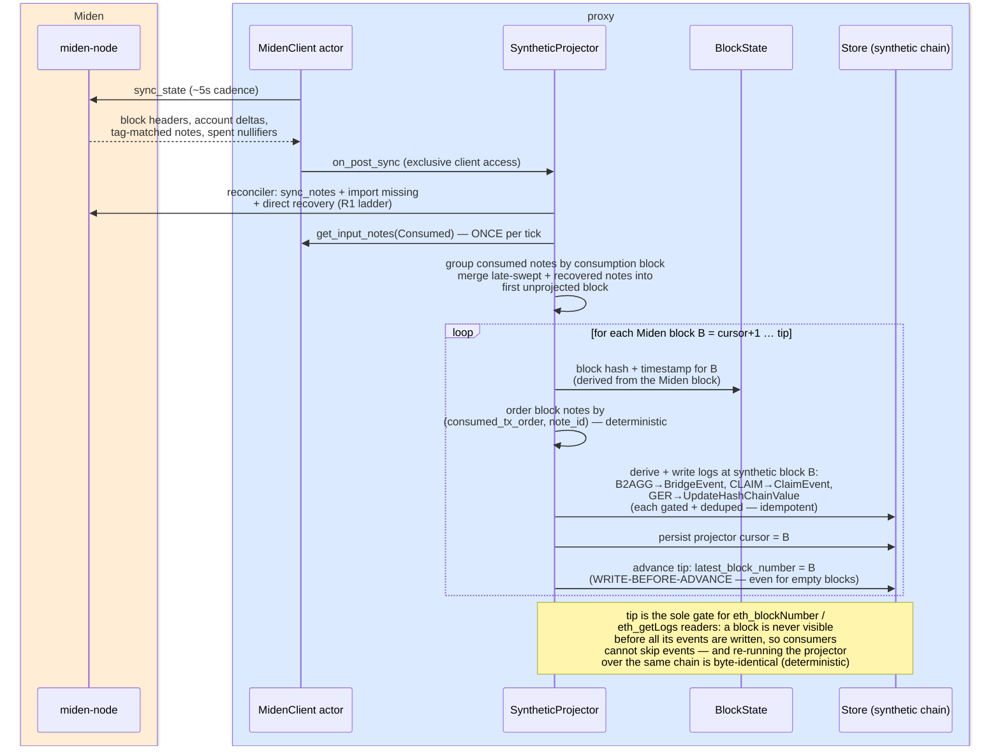
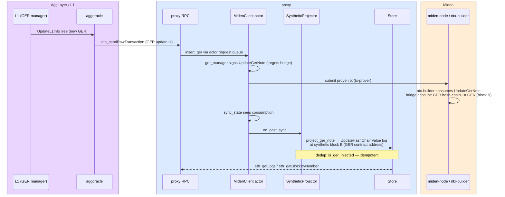
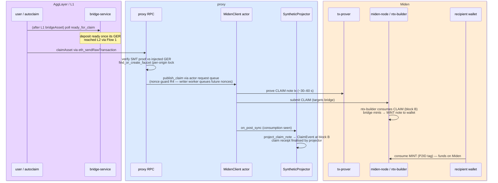
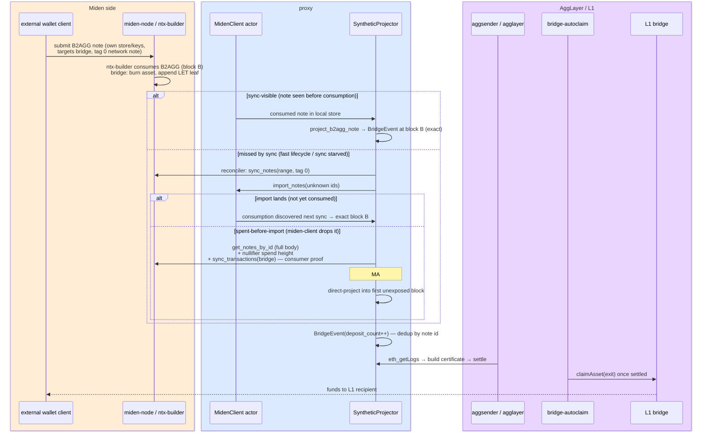
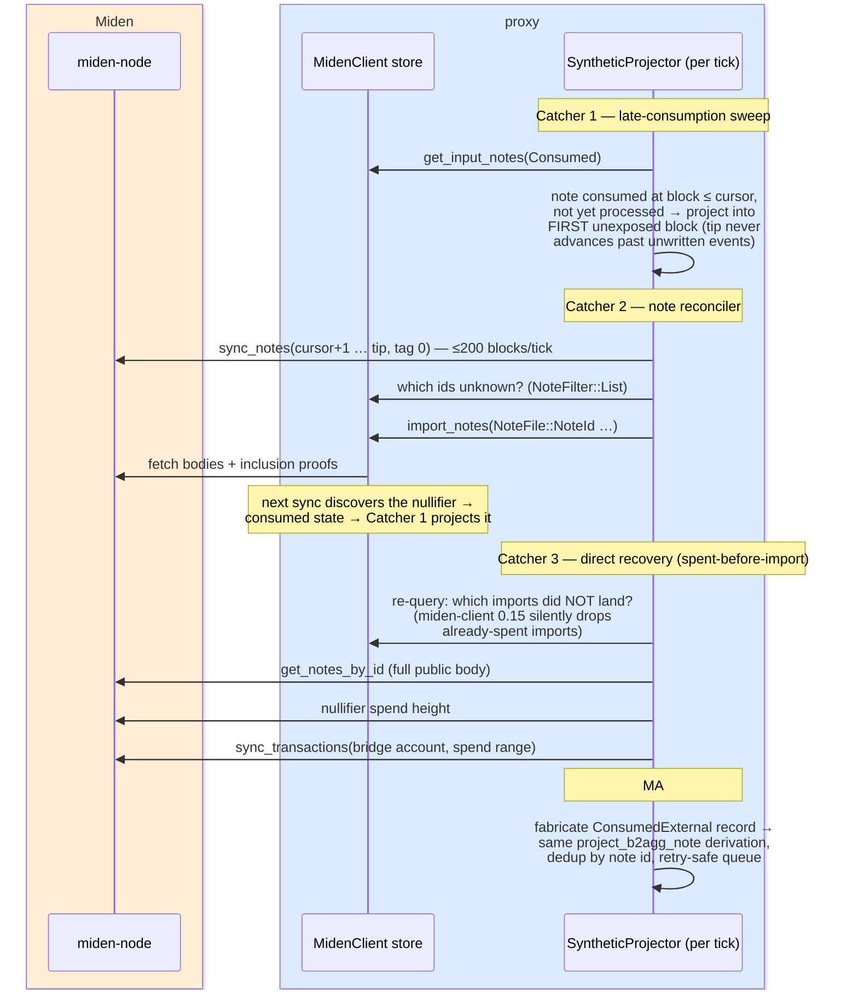
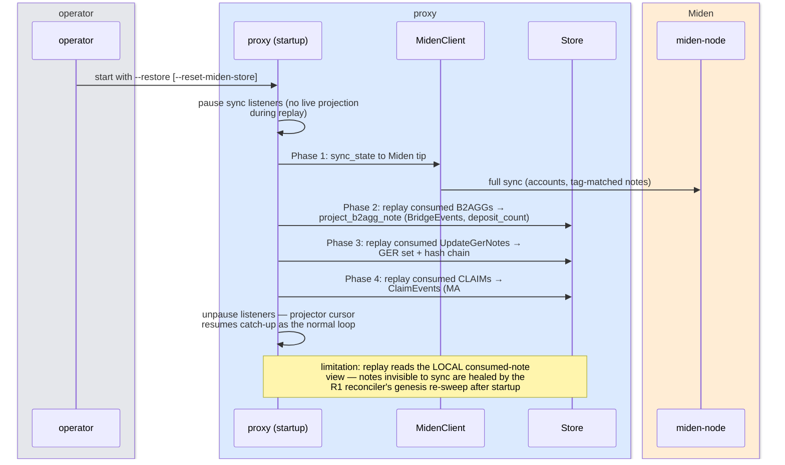
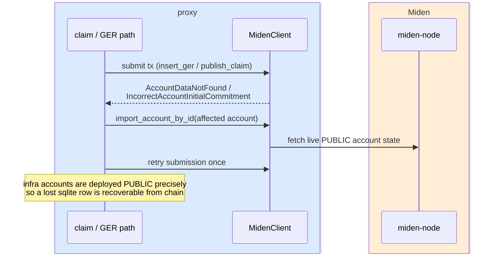

# miden-agglayer proxy — architecture & main flows

Current as of the `reopen-92-synthetic-indexer-redesign` line (SyntheticProjector
as the sole synthetic-event producer + note-visibility reconciler + direct
recovery). Supersedes `docs/architecture.png` (pre-redesign, outdated).

## Component architecture

Key invariants:
- **One `MidenClient`** per process (guarded); all Miden work — sync, claims,
  GER, proving — serializes through its single loop. This is the throughput
  ceiling (~1 proven tx/min) and why the projector needs recovery paths for
  notes whose whole lifecycle fits between two sync points.
- **The projector is the only writer** of synthetic blocks/logs and the tip
  (`Miden block N ⇒ synthetic block N`, write-before-advance — a block is never
  exposed before its events are written, so `eth_getLogs` consumers cannot skip
  events; recovered events land in the first not-yet-exposed block).
- The external wallet **never shares the proxy's sqlite** (prod topology; also
  the DB-lock isolation result).

## The synthetic block engine (projector tick)

How synthetic blocks come to exist at all: the proxy has no EVM execution — the
projector *derives* an EVM-shaped chain from Miden, one synthetic block per
Miden block (Miden-1:1), inside every sync tick:

Properties: **deterministic** (same Miden chain ⇒ byte-identical synthetic
chain), **idempotent** (crash mid-block re-projects through dedup keys),
**gap-free** (empty Miden blocks produce empty synthetic blocks, so the chain
mirrors Miden block-for-block and `eth_blockNumber` tracks the Miden tip).

## Flow 1 — GER injection (L1 → L2 info propagation)

## Flow 2 — Claim (L1 → L2 deposit delivery)

## Flow 3 — B2AGG (L2 → L1 bridge-out)

## Verification harness

`scripts/e2e-bridge-loadtest-isolated.sh` (prod-faithful independent wallet)
ends with a 0-`database is locked` gate and
`scripts/verify-event-completeness.sh`: an independent cross-check of the
miden-node DB (consumed B2AGG/CLAIM/GER notes by canonical script root) against
`eth_getLogs` — **every consumed correct note must have exactly one event at
exactly its consumption block** (`late`/`missing`/`extra` reported per type).

## Recovery flows

Three distinct recovery mechanisms exist at different layers.

### R1 — Live note recovery ladder (event completeness, in-process)

Why: notes created by external wallets that are committed **and** consumed
between two proxy sync points are never delivered by interest-based
`sync_state`; under load (claims starving the actor loop) this window grows to
minutes. Three escalating catchers:

### R2 — Startup restore (disaster recovery, `--restore`)

Rebuilds the synthetic event store from Miden after data loss
(`--reset-miden-store --restore` wipes the sqlite first; Postgres dedup keys
make the replay idempotent):

### R3 — Account self-heal (runtime, per-submission)

