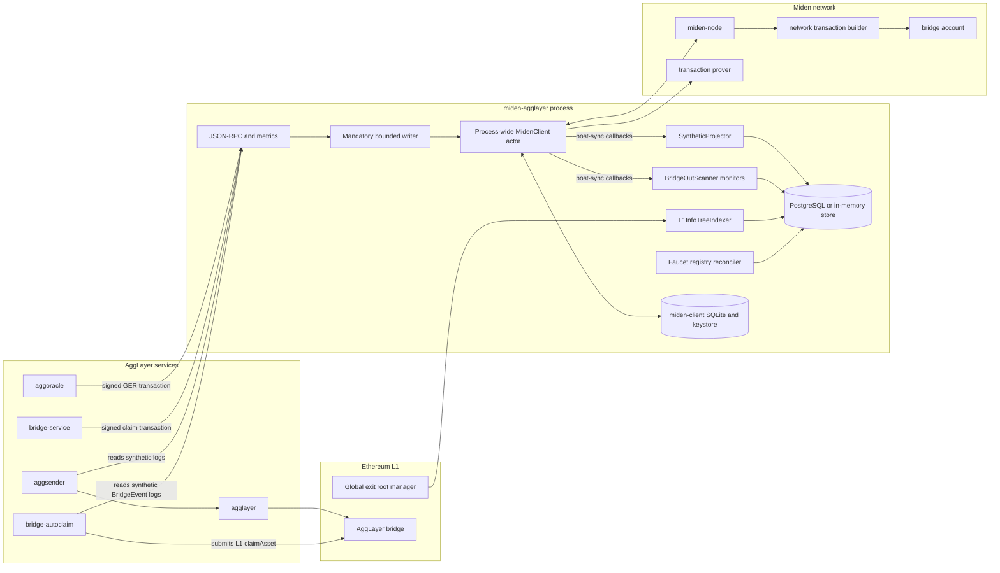
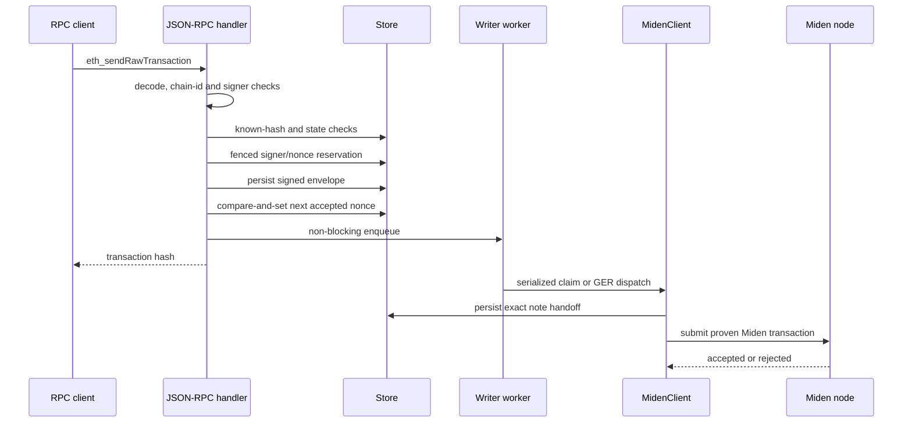
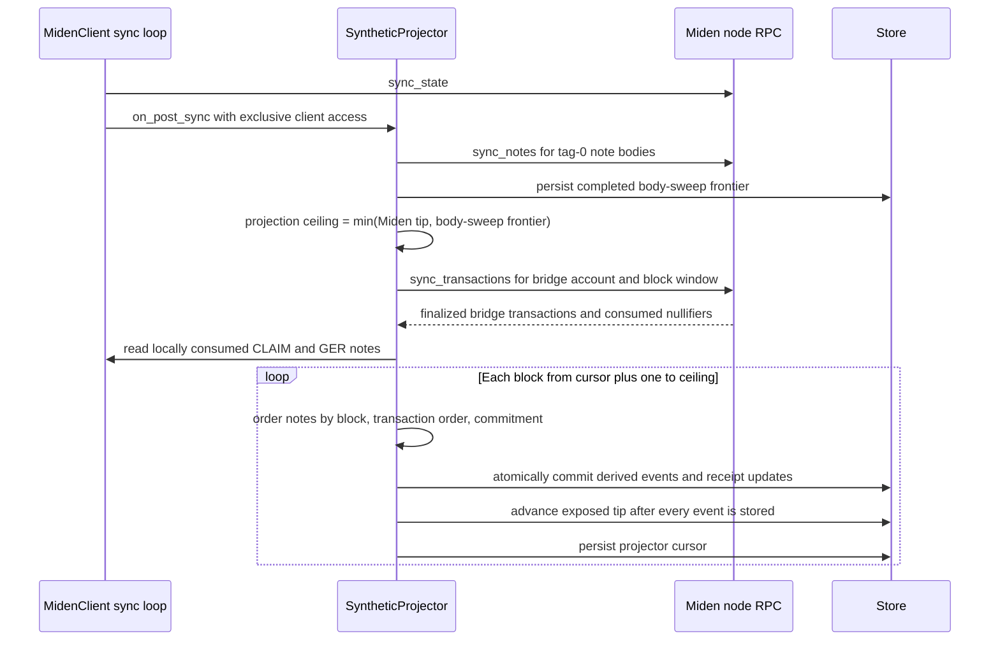

# Architecture

This document describes the implementation on `main`. The Rust source is the
authority when this overview and the code disagree.

`miden-agglayer` presents an EVM-compatible JSON-RPC surface for an AggLayer
rollup whose execution layer is Miden. It does not execute EVM blocks. Instead,
it submits bridge operations to Miden and projects finalized Miden activity into
an EVM-shaped block and log stream consumed by AggKit and bridge-service.

## Runtime components

The process has four important ownership rules:

1. `MidenClient` is a process-wide singleton. Its channel has capacity one and
   all mutable miden-client work, including synchronization and transaction
   submission, runs on its dedicated thread and runtime.
2. The writer worker is the only production path from
   `eth_sendRawTransaction` to Miden. It accepts only `claimAsset`,
   `insertGlobalExitRoot`, and `updateExitRoot` calls.
3. `SyntheticProjector` is the only live synthetic-event producer and the only
   live writer of the exposed synthetic tip. Offline `--restore` replays the
   same event derivations before the normal service starts.
4. The projector is single-process. Running multiple proxy replicas against one
   store is unsupported even though nonce admission itself is fenced in the
   database.

## Signed transaction admission

The HTTP request does not wait for proving and Miden submission. It validates
and durably admits the signed envelope, then hands it to the bounded writer.

Important behavior:

- The default queue capacity is 64 and is configurable through
  `AGGLAYER_WRITER_QUEUE_DEPTH`.
- Queue saturation is returned as JSON-RPC error `-32005`.
- A repeated signed transaction is deduplicated by transaction hash before the
  nonce check. A durable unlinked intent can be resumed after restart by
  submitting the same signed transaction again.
- `eth_getTransactionReceipt` returns `null` while work is admitted or handed
  off but not finalized. A definite failure before an ambiguous Miden handoff
  produces a status-0 receipt. An ambiguous result after the exact note handoff
  remains pending for projector reconciliation.
- `latest` transaction count is the committed frontier; `pending` is the
  accepted frontier.

The complete writer contract is documented in
[`design/RD-940-async-writer.md`](design/RD-940-async-writer.md).

## Synthetic chain projection

Synthetic block number `N` corresponds to Miden block `N`. Empty Miden blocks
still advance the synthetic chain. The store's `latest_block_number` is the
visibility boundary used by `eth_blockNumber` and `eth_getLogs`.

The note sources are deliberately different:

- B2AGG bridge-outs are externally created. Their finalized consumption comes
  from `sync_transactions` filtered to the bridge account. The tag-0
  `sync_notes` sweep supplies their bodies and gates projection until those
  bodies are available.
- CLAIM and `UpdateGerNote` notes are created by this proxy. Their consumption
  is read from the local miden-client consumed-note view.

Each event path validates provenance and fails closed:

- B2AGG notes must have the canonical script and a bridge-account consumer.
- CLAIM notes must be attributable to this bridge or this service account.
- GER notes must be attributable to the configured GER manager and bridge.

Per-event store operations are idempotent and transactional. B2AGG commits bind
the note, deposit counter, and `BridgeEvent`; CLAIM commits bind the note,
`ClaimEvent`, and linked receipt; GER commits bind injection state, hash-chain
roll, log, and linked receipt. A crash before the tip advance leaves the partial
block unexposed, and the persisted projector cursor makes replay idempotent.

Synthetic block headers form a deterministic RLP-hashed parent chain derived
from block number and fixed header fields. They do not contain a log root; log
immutability comes from reconcile-before-project and write-before-advance.

See [`SYNTHETIC-INDEXER-REDESIGN.md`](SYNTHETIC-INDEXER-REDESIGN.md) for the
projection contract and
[`design/UNIFIED-PROJECTOR.md`](design/UNIFIED-PROJECTOR.md) for the consumption
source split.

## Bridge flows

### L1 to Miden

1. `L1InfoTreeIndexer` records `(mainnetExitRoot, rollupExitRoot)` from L1 GER
   events and keys the pair by its combined hash.
2. Aggoracle submits a signed `insertGlobalExitRoot` or `updateExitRoot`
   transaction to the proxy.
3. The writer creates and submits an `UpdateGerNote` to Miden. The bridge's
   network transaction consumes it.
4. The projector emits `UpdateHashChainValue` and marks the GER injected at the
   consumption block.
5. A claim client submits `claimAsset`. The claim path checks the applied GER,
   validates the proof and destination, resolves or creates the origin-keyed
   faucet, and submits a CLAIM note.
6. When the bridge consumes the CLAIM note, the projector emits `ClaimEvent`
   and finalizes the real EVM transaction receipt at that block. The bridge
   emits the MINT note used to credit the Miden recipient.

Faucets are keyed by both origin address and origin network. ERC-20 origins are
scaled to Miden's supported decimal precision; the registry stores the origin
and Miden decimal metadata used for the reverse bridge.

### Miden to L1 or another L2

1. A wallet with its own miden-client store creates a public B2AGG note that
   targets the bridge account. It does not share the proxy's SQLite database or
   keys.
2. The Miden network transaction builder consumes the note, burns the asset,
   and appends to the bridge's local exit tree.
3. The projector attributes the bridge consumption, resolves the note body,
   and commits one `BridgeEvent` with the matching deposit count.
4. Aggsender reads the event, builds a certificate, and sends it to AggLayer.
5. For L2-to-L1 exits, the separate `bridge-autoclaim` binary discovers this
   rollup's events from the proxy, checks L1 `isClaimed`, obtains a proof from
   bridge-service, simulates the claim, and submits `claimAsset` on L1. It does
   not use bridge-service's `/pending-bridges` endpoint.

## Synchronization, monitoring, and recovery

The Miden client synchronizes on startup and every five seconds. Listener order
is store receipt maintenance, block-header cache, security monitors, then the
projector. The `BridgeOutScanner` is monitor-only: it checks LET divergence,
faucet ownership, twin notes, burn serials, MINT targets, and expected MINTs; it
does not write synthetic events or advance the tip.

`--restore` is an offline reconstruction mode. It pauses post-sync listener
side effects, reimports configured accounts, syncs to the Miden tip, recovers
missed public B2AGG notes, rebuilds faucet identities, replays B2AGG, CLAIM, and
GER events through the shared derivations, finalizes the synthetic tip and
projector cursor, resets the note-sweep cursor for a full healing pass, and
exits. `--reset-miden-store --restore` is the full local-state recovery path;
the PostgreSQL volume still contains EVM envelopes and calldata that do not
exist on Miden and therefore cannot be reconstructed from chain data alone.

The independent completeness check is
`scripts/verify-event-completeness.sh`. The production-faithful load test is
`scripts/e2e-bridge-loadtest-isolated.sh`, which uses a wallet store separate
from the proxy.
