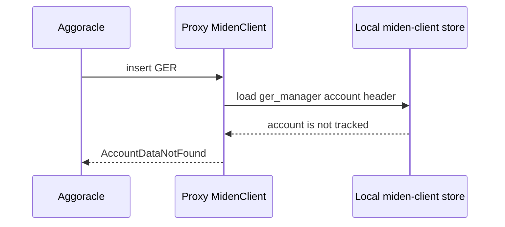

# Postmortem — bali IAIC → AccountDataNotFound (2026-05-11 → 2026-05-18)

> **Historical incident record.** Commit IDs, line numbers, deployment names,
> version references and code excerpts below describe the incident-era system.
> They are retained as evidence, not as current operating instructions. Use
> `docs/operations/runbook.md` and `docs/UPGRADE.md` for current procedures.

| Field | Value |
|---|---|
| Status | Resolved. The recovery and regression paths described in the disposition table are present on current `main`. |
| Severity | High — L1→L2 bridge stuck for ~20 wall-days; ~1.1M deposits unresolvable; marti's deposit cnt=1130654 the user-visible canary. |
| Detection | Manual — Igor / operator triage. No alert fired on the IAIC rate. |
| Author | claude-code + miden-l1-l2-debug agents on `feat/v0.3.0-self-heal`. |
| Cluster | `dev-gateway-eks`, ns `outpost-testnet-miden-testnet`, pod `miden-agglayer-0`. |
| Pre-incident image | `gatewayfm/miden-agglayer:0.2.1` = commit `388775e` (the incident-era `main`). |

## TL;DR

Two distinct bugs in the proxy fired in sequence:

1. **Mempool-conflict IAIC** (2026-05-11 → 2026-05-14). `publish_claim` built a fresh `miden_client::Client` per call against the same on-disk sqlite, bypassing the long-lived `MidenClient`'s `mpsc::channel::<Request>(1)` event loop. Under concurrent claim load two fresh clients submitted `submit_proven_transaction` calls into the Miden node's mempool simultaneously, both built atop the same `init_commitment` for the `bridge` infrastructure account. The node rejected the second with `AddTransactionError::IncorrectAccountInitialCommitment` and gRPC message `transaction conflicts with current mempool state`. 187 occurrences over 73 hours, steady ~2/hour, peaking 8/hour in the final cluster.

2. **Operator-recovery hole — AccountDataNotFound after `--reset-miden-store --restore`** (2026-05-14 18:45 onwards). The documented recovery for IAIC instructed operators to run the proxy with `--reset-miden-store --restore`. The bali operator did so three times in 21 seconds. But `restore.rs::restore` Phase 1 (`sync_miden_block`) called only `client.sync_state()` — which syncs deltas for already-tracked accounts and never imports unknown ones. After `--reset-miden-store` wiped `store.sqlite3`, `--restore` left `latest_account_headers` empty for every entry in `bridge_accounts.toml`. From `2026-05-14T18:45:39Z` onwards every aggoracle push failed at `eth_sendRawTransaction` with `account data wasn't found for account id 0xe9a21e616d9ed59016d481c7001393` (the ger_manager). Zero new GERs landed for ~3 wall-days until escalation.

Both bugs are closed in v0.3.0 by structural fixes, with safety-net runtime self-heal layered on top.

## Evidence — Loki, raw

Query 1 — IAIC density over 30d (literal `|=`, then bucketed by hour client-side):

```
{namespace="outpost-testnet-miden-testnet", container="miden-agglayer"}
  |= `incorrect account initial commitment`

189 results total
 first  2026-05-11T17:18:52.727272Z   miden_agglayer_service::service:180
 last   2026-05-14T18:40:10.236794Z   rpc::error:85
```

Hourly bucket (truncated to the active window):

```
2026-05-11T17  2
2026-05-11T18  2
2026-05-11T19  3
2026-05-11T20  2
2026-05-11T21  2
2026-05-11T22  1
2026-05-11T23  3
2026-05-12T00..23  range 1-4 (steady)
2026-05-13T00..23  range 1-4 (steady)
2026-05-14T00  3
2026-05-14T01  3
2026-05-14T02..11  range 1-2 (steady)
2026-05-14T12  6
2026-05-14T13  6
2026-05-14T14  4
2026-05-14T15  4
2026-05-14T16  8   ← peak cluster
2026-05-14T17  2
2026-05-14T18  6   ← then silence
```

The flat-then-spike shape is consistent with chronic concurrent-submission load, not OOM-coincident or restart-coincident bursts. The 12:00-18:40 cluster on 2026-05-14 is correlated with rising claim volume (more claimsponsor retries against the proxy as marti's deposit and others remained stuck).

Query 2 — first IAIC + immediately-preceding context (`2026-05-11T16:14:00 → 16:15:30`):

```
16:12:04 → 16:13:41   ~96 lines: claimAsset retry storm for global_index
                       18446744073710679244, each rejected with
                       "claim already submitted" (correctly dedup'd at
                       service.rs:180 IDX guard)
16:14:34.214 Z  WARN  service_send_raw_txn.rs:253:
               "L1 exit roots don't match injected GER
                (L1 may have advanced), storing without roots"
               ← the RD-862 race firing
16:14:51.326 Z  ERROR service_send_raw_txn.rs:68:
               "insert_ger failed: RpcError(...)"
16:14:51.326 Z  INFO  service.rs:180:
               "eth_sendRawTransaction: ERR RPC error: grpc request failed
                for submit_proven_transaction: invalid request parameters
                (incorrect account initial commitment):
                code: 'Client specified an invalid argument',
                message: \"transaction conflicts with current
                          mempool state\""
```

The node's rejection message — `transaction conflicts with current mempool state` — was the key. Initially we hypothesised "stale local commitment vs. live node commitment" (cache lag). The node's actual error text reframed it: a tx for the same account is already pending in mempool, and your new tx builds atop the same `init_commitment` it does — that's a mempool serialization conflict, not a cache lag.

Query 3 — operator-action transcript on 2026-05-14T18:30 → 19:00:

```
16:21:40.533Z  pod restart (Command { ... miden_node: rpc.testnet.miden.io:443 ... })
16:21:45.850Z  ERROR src/main.rs:548: startup diagnostic:
               "1 managed account(s) are LOCKED in miden-client:
                [V0(AccountIdV0 { suffix: 1645082455596831488, prefix: 1... })]"

18:35:07.952Z  pod restart (no recovery flags)
18:35:29.515Z  pod restart
18:36:02.535Z  pod restart
18:36:50.524Z  pod restart
18:38:12.514Z  pod restart
18:39:21.638Z  pod restart                 ← 6 plain restarts in ~4 minutes

18:40:10.237Z  ← LAST IAIC fires, on the previous pod incarnation

18:45:18.593Z  pod restart with --reset-miden-store --restore
18:45:18.594Z  INFO recovery.rs:50:
               "reset_miden_store: deleted /var/lib/.../store.sqlite3"
18:45:18.594Z  WARN main.rs:270:
               "reset_miden_store: removed 1 sqlite file(s);
                keystore and bridge_accounts.toml preserved"
18:45:18.601Z  INFO restore.rs:60: "=== RESTORE: starting state reconstruction ==="
               (Phase 1 sync_state ONLY — NO account reimport)
               "=== RESTORE: complete ==="

18:45:21.564Z  pod restart with --reset-miden-store --restore (2nd time)
18:45:21.572Z  RESTORE start/complete
18:45:39.514Z  pod restart with --reset-miden-store --restore (3rd time)
18:45:39.520Z  RESTORE start/complete

After 18:45:39: every aggoracle push → AccountDataNotFound.
```

The operator escalated correctly by the existing runbook. The runbook was the trap.

## Mechanism — bug 1, mempool-conflict IAIC

`miden_client::Client` maintains an in-memory cache of every tracked account's current commitment. `Client::submit_new_transaction(account_id, tx_request)` builds a tx atop `(account_id, init_commitment_in_cache)` and submits to the Miden node. The node validates:

1. `init_commitment` matches the latest committed block for `account_id`, OR
2. There is no pending mempool tx for `account_id`.

If a pending tx exists in mempool whose `init_commitment` matches what we just sent, the node rejects the second tx as a conflict (only one of them can commit; whichever lands wins, the other is invalid by construction).

In the affected incident-era code, `publish_claim` built a fresh `Client` per call:

```rust
let rt = tokio::runtime::Runtime::new()?;
rt.block_on(async {
    let mut client = ClientBuilder::new()
        .rpc(rpc)
        .sqlite_store(store_path)   // ← same file as the long-lived client
        .authenticator(keystore)
        .in_debug_mode(DebugMode::Enabled)
        .build()
        .await?;
    client.sync_state().await?;
    // ... publish_claim_internal submits a CLAIM tx targeting the
    //     `bridge` account ...
});
```

This bypassed the long-lived `MidenClient`'s `mpsc::channel::<Request>(1)` event loop. Two concurrent `publish_claim` calls for distinct globalIndexes:

- Both built a fresh `Client`.
- Both synced state, observed the same `init_commitment` for `bridge`.
- Both submitted CLAIM txs targeting `bridge`.
- First arrived, was accepted into mempool.
- Second arrived a few hundred milliseconds later, hit the conflict.

The node returned `AddTransactionError::IncorrectAccountInitialCommitment` to the second. The proxy logged it as `insert_ger failed` at `src/service_send_raw_txn.rs:68` (the path that handles the chained insert_ger from the claim flow) and surfaced it back to the JSON-RPC caller as `eth_sendRawTransaction: ERR RPC error: ...`.

### Why we initially misread this as cache lag

The variant name `IncorrectAccountInitialCommitment` and Display `incorrect account initial commitment` strongly suggest "your local cache is wrong". The first hypothesis was: long-lived client's in-memory cache is N seconds stale relative to live node state. The cure path c491eca implements — `reimport_account` via `import_account_by_id(overwrite=true)` — was framed for this.

The gRPC message `transaction conflicts with current mempool state` reframed it. Reimporting the account doesn't help if the conflicting tx is your own pending submission; the local commitment IS correct, the node just won't take a second tx atop it.

### Why removing the fresh client fixes it (e3e3e2a)

After the unify, `publish_claim` routes through `MidenClient::with(...)`:

```rust
pub async fn with<Fn>(&self, closure: Fn) -> anyhow::Result<()>
where Fn: for<'c> FnOnce(&'c mut MidenClientLib) -> ... {
    let request = Request { ... };
    if self.sender.send(request).await.is_err() { ... }
    let result = response_receiver.await?;
    result
}
```

`self.sender` is the producer half of `mpsc::channel::<Request>(1)` (`miden_client.rs:126`). The consumer side is `Self::run`'s loop:

```rust
loop {
    tokio::select! {
        receiver_result = receiver.recv() => {
            let Some(request) = receiver_result else { break };
            let result = (request.closure)(&mut client).await;
            request.response_sender.send(result).unwrap_or(());
        },
        ...
    }
}
```

Capacity 1 + serial `await` of the closure means: no second request is pulled from the channel until the current one's closure has fully returned. Each submission closure body (insert_ger, publish_claim_internal, restore phases) calls `wait_for_transaction_commit` after submitting, which polls until the Miden node commits the tx (or times out). The closure does not return — and the channel does not advance — until the previous tx is settled on chain.

Net property: **no two `submit_new_transaction` calls are ever in flight against the Miden node from this proxy.** Mempool conflict is structurally impossible by construction.

## Mechanism — bug 2, AccountDataNotFound after `--reset-miden-store --restore`

`src/main.rs::main` handles the recovery flags:

```rust
if command.reset_miden_store {
    let removed = miden_agglayer_service::recovery::reset_miden_store(&effective_store_dir)?;
    tracing::warn!(
        "reset_miden_store: removed {removed} sqlite file(s) from {}; \
         keystore and bridge_accounts.toml preserved",
        effective_store_dir.display()
    );
}
if command.restore {
    miden_agglayer_service::restore::restore(...).await?;
    return Ok(());
}
```

`reset_miden_store` deletes `store.sqlite3` (+ WAL/SHM). On the next startup, miden-client rebuilds an empty sqlite. `restore::restore` then runs:

```rust
pub async fn restore(...) -> anyhow::Result<RestoreResult> {
    // Phase 1: Sync miden state
    let block_num = sync_miden_block(miden_client, store).await?;
    // Phase 2: Scan miden consumed B2AGG notes (bridge_outs)
    // Phase 3: Scan consumed UpdateGerNote notes (gers)
    // Phase 4-5: stamp block + verify
    ...
}

async fn sync_miden_block(miden_client: &MidenClient, store: &Arc<dyn Store>)
  -> anyhow::Result<u64> {
    miden_client.with(|client| {
        Box::new(async move {
            client.sync_state().await?;   // ← syncs deltas for already-tracked
                                          //    accounts. Does NOT import unknown.
            Ok(())
        })
    }).await?;
    let block_num = store.get_latest_block_number().await?;
    Ok(block_num)
}
```

`sync_state()` is incremental — it requires the account to already be tracked in `latest_account_headers`. After `--reset-miden-store`, that table is empty. `sync_state` finds no tracked accounts, syncs nothing, returns Ok. The restore phases 2/3 walk on-chain notes to rebuild PgStore state, but never call `Client::import_account_by_id` to populate `latest_account_headers`.

On the next aggoracle push:



Surfaced to the JSON-RPC caller as `eth_sendRawTransaction: ERR account data wasn't found for account id 0x...`.

### Why 55fa17a fixes it

The fix adds Phase 0 to `restore::restore`:

```rust
pub async fn restore(...) {
    // Phase 0: Re-import every bridge_accounts.toml account from the live
    // Miden node. Closes the chain that locked bali: --reset-miden-store
    // --restore is a footgun because Phase 1 sync_state() doesn't import
    // unknown accounts. Phase 0 ensures latest_account_headers is populated.
    tracing::info!("Phase 0: re-importing bridge accounts from Miden node...");
    crate::account_recovery::reimport_known_accounts(miden_client, accounts).await;
    tracing::info!("Phase 0 complete: bridge account reimport pass done");

    // Phase 1: Sync miden state (existing)
    ...
}
```

`reimport_known_accounts` iterates `accounts.toml`, calls `import_account_by_id` for each, and logs per-account success or `AccountNotFoundOnChain` (for locally-deployed-but-not-network-tracked accounts like `wallet_hardhat`). After Phase 0, `latest_account_headers` is populated for every network-tracked infrastructure account.

The next submission lookups succeed; AccountDataNotFound cannot fire from this recovery path.

## Why this took 73+ hours of chronic firing without escalation

1. **No alert on IAIC rate at incident time.** Metrics existed, but no deployed Prometheus rule fired on a sustained non-zero rate.
2. **Symptom looked transient at low rates.** ~2/hour reads as "intermittent flakiness" on a testnet — not a P2 page.
3. **Existing runbook framed IAIC as a sqlite-staleness problem.** That framing pointed at `--reset-miden-store --restore`, which inadvertently locked the system harder.
4. **No before/after test of the documented recovery flow at incident time.**
   That gap is now covered by `scripts/e2e-reset-restore-recovery.sh`.

## Fix mapping (commit → bug)

| Commit | Closes | Notes |
|---|---|---|
| `e3e3e2a` | Bug 1 (IAIC mempool conflict) | Structural fix. Routes publish_claim through the long-lived MidenClient's channel-of-1. |
| `c491eca` | Bug 1 (safety net) + Bug 2 (defense in depth) | Runtime inline retry on the two recoverable error variants. Will NOT cure bali's existing state because its accounts are Private (`import_account_by_id` returns `AccountIsPrivate`); covers post-redeploy. |
| `55fa17a` | Bug 2 (operator-recovery hole) | Phase 0 in restore reimports every account before sync_state. Makes `--reset-miden-store --restore` a real recovery path for the first time. |
| `34d4316` | Pre-condition for above | Restores `AccountStorageMode::Public`; without this the runtime self-heal can't reimport because the accounts can't be imported by ID. Regression from `dbe5c2d`. |
| `3d92040`, `9cb3878` | Adjacent — indexer hardening | Indexer cursor persistence + backfill override. Closes the 27 race-poisoned STATE-C orphans. |
| `f05ab42` | Defensive | Atomic write for bridge_accounts.toml. Closes a mid-write OOM truncation hazard. |
| `0fd7fc0` | Operational | In-process migrator. Removes the `agglayer-migrate` footgun. |
| `bc5c157` | Security-adjacent | Clamps alloy http transport to info; stops Sepolia apiKey leak in L1 RPC logs. |

## Lessons

1. **A documented recovery procedure that locks the system harder is the worst kind of operational regression.** Test the documented recoveries end-to-end against the broken state they're meant to fix. `scripts/e2e-reset-restore-recovery.sh` and `scripts/e2e-account-self-heal.sh` now enforce this.

2. **Trust the actual error message, not the variant name.** `IncorrectAccountInitialCommitment` reads like cache staleness; the gRPC tail `transaction conflicts with current mempool state` is the actual cause. Both hypotheses pointed to plausible fixes, but only the structural one (unify on channel-of-1) closes mempool conflict; cache reimport doesn't.

3. **Concurrency property = type-system invariant > runtime assertion.** The unify (`e3e3e2a`) makes "no two submissions in flight against the node" a property of the type system (capacity-1 channel + serial await), not a runtime check. Once unified, you can't accidentally violate it without restructuring the code — that's the property worth shipping.

4. **`import_account_by_id` only works on Public/Network accounts.** Treat `AccountStorageMode` for infrastructure accounts as a recovery-path concern, not just a privacy one. `dbe5c2d` lost this intent during the 0.14.x migration; `34d4316` restores it explicitly; the comment in `src/init.rs::add_wallet` now makes the dependency loud.

5. **Two related bugs in sequence look like one bug from the outside.** The IAIC → AccountDataNotFound transition could have been one root cause with two manifestations, or two distinct bugs in series. The Loki density chart distinguished them: chronic-flat-then-spike for bug 1, single-event-with-3-reset-spam for bug 2 are signatures that don't share a parent.

## Current disposition

| Incident concern | State on current `main` |
|---|---|
| Concurrent claim submission | Claim publication uses the managed Miden client path; the regression is covered by `scripts/e2e-iaic-mempool-conflict.sh`. |
| Empty local Miden store after reset | Restore re-imports configured accounts before syncing; `scripts/e2e-reset-restore-recovery.sh` and `scripts/e2e-account-reimport.sh` cover the recovery path. |
| Recoverable account errors | Account recovery handles `AccountDataNotFound` and `IncorrectAccountInitialCommitment`; `scripts/e2e-account-self-heal.sh` exercises the self-heal path. |
| Operator procedure | The current source of truth is `docs/operations/runbook.md`; the Bali redeploy document is incident-specific. |
| Alerting | The service exports recovery and error metrics. Alert-rule ownership and deployment are outside this repository. |

The incident-era wishlist has been removed from this record: unfinished product
ideas are not current operating requirements and should be tracked as issues,
not as permanently stale postmortem checkboxes.
