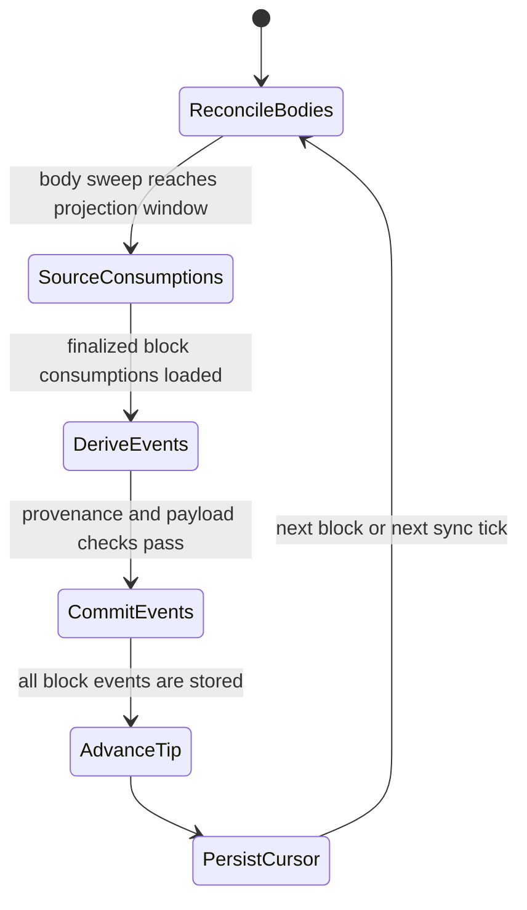
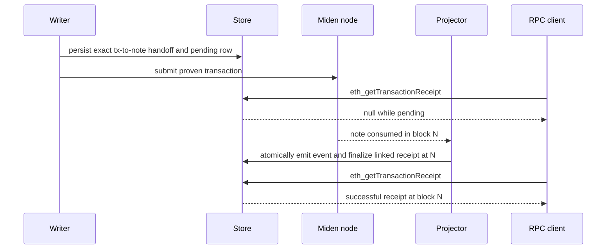

# Synthetic indexer contract

Status: implemented on `main`.

This document records the contract enforced by `SyntheticProjector`. It is not
an implementation plan or a list of future migration phases.

## Purpose

The proxy exposes EVM-shaped blocks and logs, but Miden is the execution layer.
`SyntheticProjector` follows finalized Miden state and derives three event
families:

| Synthetic event | Miden source |
| --- | --- |
| `BridgeEvent` | canonical B2AGG note consumed by the configured bridge |
| `ClaimEvent` | CLAIM note attributable to this deployment |
| `UpdateHashChainValue` | `UpdateGerNote` attributable to the configured GER manager and bridge |

The projector is the only component allowed to emit these events or update the
exposed synthetic tip during normal service operation. Offline `--restore`
replays the same derivations before the normal service starts. Submission code
creates Miden notes and records durable receipt links; it does not synthesize
successful events.

## Numbering and visibility

Synthetic block `N` is Miden block `N`. Empty Miden blocks are represented, so
the exposed chain is monotonic and gap-free.

For every block the ordering is:

1. reconcile public tag-0 note bodies;
2. source finalized consumptions;
3. derive and transactionally store events and linked receipt updates;
4. set `latest_block_number` to expose the block;
5. persist the projector cursor.

If the process stops after an event commit but before the tip advance, readers
cannot see that block yet. If it stops after the tip advance but before the
cursor write, the next run reprocesses the block through idempotent store
operations.

The store tip, not `BlockMonitor`, is authoritative for `eth_blockNumber` and
range resolution. `BlockState` supplies deterministic RLP-compatible block
headers and hashes. Header hashes are derived from fixed header fields and the
parent hash; they do not commit to the log set.

## Consumption sources

One local feed cannot reliably serve every note type:

- B2AGG notes are made by external wallets and may be created and consumed
  between two proxy syncs. The projector reads bridge-account transactions for
  `[cursor + 1, current Miden tip]` through `sync_transactions`, obtains their
  finalized input nullifiers and block/transaction order, and resolves each
  canonical B2AGG body.
- CLAIM and GER notes are made by the proxy, with their output metadata and
  durable EVM-transaction links recorded before those specific notes are
  submitted. Their consumed records come from the local miden-client store.

The note reconciler walks `sync_notes` for public tag-0 notes. Its persisted
cursor means “all note bodies through this Miden block were swept,” not “all
consumptions were discovered.” Projection runs only after that cursor reaches the
current Miden sync tip. Holding the synthetic tip while the body sweep catches up
is safe. Publishing a block and adding a missing event later is not.

The exact source split and body-resolution path are documented in
[`design/UNIFIED-PROJECTOR.md`](design/UNIFIED-PROJECTOR.md).

## Determinism and idempotency

Within a projection bucket, notes are ordered by:

1. consumed Miden block height;
2. consuming transaction order;
3. B2AGG input-note position within that transaction;
4. note details commitment;
5. unique NoteId.

The first field is retained in the total ordering even though normal buckets
contain one block. The same order is used by restore so deposit counts and the
GER hash chain match live projection.

The store supplies the idempotency boundaries:

- B2AGG: the unique NoteId receives a durable execution-order deposit
  reservation before any quarantine/deferral gate; emission atomically marks
  that reservation emitted and inserts the `BridgeEvent`.
- CLAIM: note identity, `ClaimEvent`, and any linked receipt finalization are
  one atomic commit.
- GER: injection flag, GER hash-chain roll, event, handoff confirmation, and
  any linked receipt finalization are one atomic commit.

Replaying the same input reuses its reservation and does not roll the GER chain
twice or duplicate a log.

## Receipt linkage

B2AGG has no originating EVM transaction, so its synthetic transaction hash is
derived deterministically from the note identity. CLAIM and GER submissions do
have real signed EVM hashes. Immediately before submitting that CLAIM or GER
note, the writer persists an exact EVM-transaction-to-note handoff and a pending
transaction row. Prerequisite faucet deployment/registration for a new token is
a separate Miden side effect and can occur before the CLAIM handoff.

Historical notes without a durable link use deterministic synthetic hashes.
Receipt lookup can synthesize a successful receipt from a stored synthetic log
when no real transaction row exists.

## Provenance and failure behavior

Event derivation is fail closed:

- a B2AGG must resolve to the canonical script, valid destination, known asset
  origin, and bridge-account consumption;
- a CLAIM must be attributable to this bridge or its configured service
  account;
- an `UpdateGerNote` must be attributable to the configured GER manager (or the
  legacy service-account fallback) and target this bridge.

Untranslatable bridge consumptions are quarantined or alarmed rather than
turned into guessed events. A bounded completeness auditor compares settled
local B2AGG observations with exact-block synthetic logs without mutating the
chain.

## Persistence and recovery

Two cursors are stored independently:

- projector cursor: last fully projected Miden block;
- reconcile cursor: last completed tag-0 note-body sweep window.

Normal restarts resume both. `--resweep-from-genesis` deliberately resets the
body-sweep cursor. `--restore` replays B2AGG, CLAIM, and GER history through the
same derivation functions, advances the projector cursor to the Miden tip, and
resets the body-sweep cursor so the next normal boot performs the healing
history sweep.

## Deployment constraint

The projector is a single in-process owner of its cursor, event order, deposit
counter sequence, and synthetic tip. Multiple running replicas against one
store are unsupported. Database fencing in the writer protects signed nonce
admission but does not make projection multi-writer safe.
