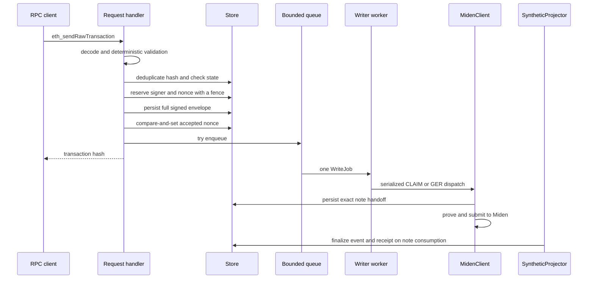

# RD-940 async writer

Status: implemented and mandatory on `main`.

The writer decouples JSON-RPC acceptance from slow Miden proving and
submission. It is a single bounded dispatch worker; `MidenClient` remains the
process-wide serialization boundary for all miden-client mutations.

## Current flow

The request path performs chain-id validation, signer recovery and allow-list
enforcement, selector decoding, destination/GER state checks, transaction-hash
deduplication, per-signer ordering, and a store-backed fenced nonce
reservation. The signed envelope is durable before the accepted nonce advances.

The production service refuses to start a write without a writer handle. The
queue defaults to 64 entries and can be changed with
`AGGLAYER_WRITER_QUEUE_DEPTH`. Admission uses `try_send`; saturation returns
JSON-RPC `-32005` with `writer queue saturated; retry`.

Concurrent HTTP delivery may place a future nonce ahead of its predecessor.
The handler waits up to 30 seconds for the gap to close. Stale nonces fail
immediately. A lower durable unlinked intent blocks later nonces until that
exact signed transaction is resumed.

## Idempotency and restart behavior

Known hashes are classified before nonce rejection:

- a process-local queued or submitting hash returns the same hash;
- a handed-off or terminal store row returns the same hash;
- an unlinked pending row is a durable admission intent and can be re-enqueued
  by submitting the same signed transaction after restart.

The queue itself is not durable and there is no autonomous queue replay. The
store preserves the signed envelope and accepted nonce, but the caller must
rebroadcast the identical signed transaction to resume an unlinked intent.
A different hash cannot take over the occupied nonce.

Store-backed nonce reservations prevent two processes from executing different
transactions at the same signer/nonce while their leases are live. This does
not make the service multi-replica safe: the synthetic projector is still a
single-process component.

## Claim and note handoff fencing

The worker acquires the per-global-index claim fence when it dispatches the
claim, not when the HTTP request enters the queue. `ClaimGuard` conditionally
releases only its current fence on cancellation or a pre-submit failure.

Immediately before submitting the corresponding CLAIM or GER note, each path
persists its exact note identity, transaction-to-note link, and pending receipt.
A first claim for a new token may deploy and register its faucet before this
CLAIM-specific handoff. After the handoff, a stale guard cannot reopen the
claim and a retry cannot construct a second random note. Errors after this
boundary are treated as ambiguous and leave the receipt pending for the
projector's bounded reconciliation.

An already-landed claim is accepted with a status-0 receipt and consumes its
nonce, matching an EVM `AlreadyClaimed` revert without emitting another event.

## Receipt and transaction RPC contract

- `eth_sendRawTransaction` returns the signed transaction hash once durable
  admission and enqueue succeed.
- `eth_getTransactionByHash` returns a pending transaction with
  `blockHash`, `blockNumber`, and `transactionIndex` set to JSON `null`; other
  numeric fields are hex strings.
- `eth_getTransactionReceipt` returns JSON `null` until a terminal result.
- The projector finalizes successful CLAIM and GER receipts at the Miden block
  where the linked note is consumed.
- A definite pre-handoff failure or queue-age expiry becomes a status-0
  receipt. Work with an exact durable handoff is never failed by a concurrent
  timeout.
- `eth_getTransactionCount(..., "latest")` reports the committed frontier;
  `"pending"` reports the accepted frontier.

## Queue TTL and shutdown

`AGGLAYER_WRITER_TX_TTL` controls the default five-minute TTL. Only the worker
that has dequeued an item may expire it, and only before creating the dispatch
future. The maintenance task renews live nonce reservations and evicts aged
terminal cache entries; it never terminalizes queued or submitting work.

When the RPC server stops, `main` signals the worker, waits 20 seconds, and
records any remaining non-terminal count in
`/tmp/agglayer-writer-queue-snapshot`. The next boot publishes that count to
`agglayer_writer_dropped_on_restart_total`. Residual work still requires the
same-hash rebroadcast described above.

## Observability and tests

The writer exports queue depth, in-flight jobs, job duration, failure,
queue-full rejection, restart residual, and shutdown outcome metrics under the
`agglayer_writer_*` prefix.

The maintained end-to-end scenarios are the six
`scripts/e2e-rd940-*.sh` scripts, orchestrated by `make e2e-rd940`. The
`scripts/e2e-iaic-mempool-conflict.sh` scenario remains the regression check for
serialized Miden submission.

## 2.3 BlockMonitor status

`BlockMonitor` currently holds a reference to `BlockState` and a monotonic
`AtomicU64` tip mirror. It does not own synthetic event writes, the block-header
cache, or the authoritative tip. `eth_blockNumber` reads the store and refreshes
the mirror, which avoids the stale-cache failure recorded in the July 2026
postmortem. `SyntheticProjector` writes the store tip directly.

## Deliberate limits

There is one worker, no worker pool, no standalone durable queue/outbox, no
custom transaction-status RPC, and no synthetic pending block. `BlockMonitor`
is only a monotonic cache around `BlockState`; the store remains authoritative
for the synthetic tip.
