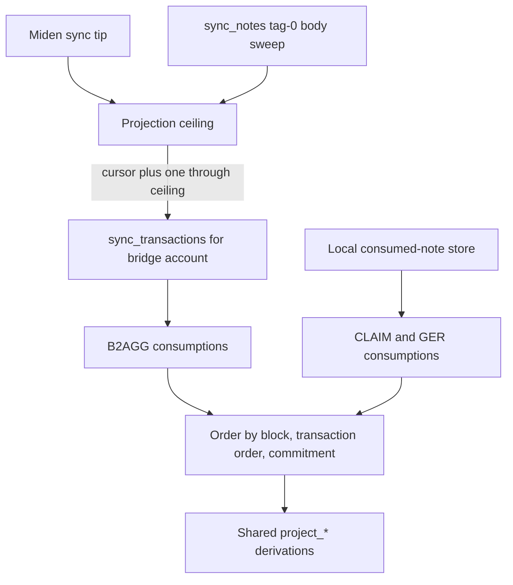

# Unified projector: authoritative B2AGG consumption sourcing

Status: implemented on `main`.

This design note explains why `SyntheticProjector` uses two consumption
sources. It supersedes the former late-consumption sweep and direct-recovery
queue.

## The consistency problem

The local miden-client store is interest based. An external wallet can create a
public B2AGG note and the network transaction builder can consume it before the
proxy's next `sync_state`. A note-body import sweep can recover the body, but
waiting for the local store to later discover the spend is not a safe basis for
sealing an immutable synthetic block.

CLAIM and GER notes have a different lifecycle: this proxy creates them through
its serialized Miden client, records their output metadata and receipt linkage,
and observes their consumed state locally.

## Implemented source split

The ceiling is `min(tip, reconcile_cursor)`, where `reconcile_cursor` is the
last fully completed note-body sweep window.

For B2AGG, `sync_transactions` is filtered to the configured bridge account.
It supplies the finalized block number, consuming transaction order, input
nullifiers, and an unauthenticated note id when the transaction carries one.
The projector accepts a body only after the normal B2AGG script and
bridge-consumer checks pass.

For CLAIM and GER, the projector groups records from
`get_input_notes(NoteFilter::Consumed)` by their consumed block. B2AGG records
are explicitly excluded from this local path so the sources remain disjoint.

## B2AGG body resolution

A consumed external input record no longer exposes the metadata needed to
recompute its nullifier. The projector therefore caches canonical B2AGG bodies
while they are still committed and keyed by nullifier.

Resolution order is:

1. body captured from an imported, still-committed local note;
2. body recovered during the spent-before-import reconciliation path;
3. authoritative `get_notes_by_id` fetch when the transaction supplies a note
   id.

The node's transaction feed can briefly lead its note database. Missing
unauthenticated bodies are retried for a bounded number of ticks. A body that
still cannot be authenticated is skipped loudly rather than freezing the
synthetic tip or fabricating a `BridgeEvent`. Cache entries are removed only
after the corresponding projector cursor has been persisted.

## Removed behavior

The live projector no longer:

- projects notes from an earlier sealed Miden block into a later synthetic
  block;
- treats the local B2AGG consumed-note feed as authoritative;
- runs a late-consumption sweep;
- maintains a separate direct-recovered event queue; or
- advances a consumption-reconciliation frontier from the note-creation feed.

The note sweep remains, but only as a body-availability frontier. Holding the
tip at that frontier preserves exact-block `eth_getLogs` behavior.

## Operational checks

`projector_visibility_barrier_held_blocks` shows how far projection is held
behind the Miden tip. The completeness auditor periodically checks older
consumed B2AGG notes against exact-block logs and de-duplicates alarms in
memory. It is detection only and never repairs an exposed block.

The correctness gate is the independent node-versus-log verifier in
`scripts/verify-event-completeness.sh` and the isolated-wallet load test in
`scripts/e2e-bridge-loadtest-isolated.sh`.
