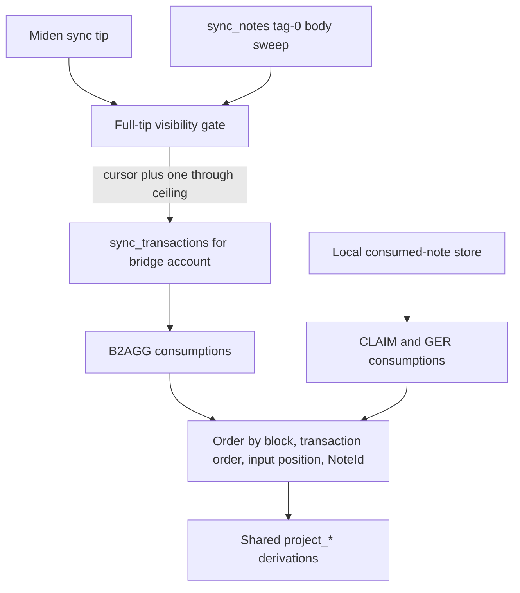

# Unified projector: authoritative B2AGG consumption sourcing

Status: implemented on `main`.

This design note explains why `SyntheticProjector` uses two consumption
sources. It supersedes the former late-consumption sweep and direct-recovery
queue.

## The consistency problem

The local miden-client store is interest based. An external wallet can create a
public B2AGG note and the network transaction builder can consume it before the
proxy's next `sync_state`. A note-body import sweep can recover the body, but
waiting for the local store to later discover the spend is not a safe basis for
sealing an immutable synthetic block.

CLAIM and GER notes have a different lifecycle: this proxy creates them through
its serialized Miden client, records their output metadata and receipt linkage,
and observes their consumed state locally.

## Implemented source split

Projection waits until `reconcile_cursor >= tip`, then processes through that tip.

For B2AGG, `sync_transactions` is filtered to the configured bridge account.
It supplies the finalized block number, consuming transaction order, input
nullifiers, and input order. The pinned miden-client drops protocol input
headers, so the reconciler persists the B2AGG nullifier-to-NoteId join before
advancing its cursor.
The projector accepts a body only after the normal B2AGG script and
bridge-consumer checks pass.

For CLAIM and GER, the projector groups records from
`get_input_notes(NoteFilter::Consumed)` by their consumed block. B2AGG records
are explicitly excluded from this local path so the sources remain disjoint.

## B2AGG body resolution

A consumed external input record no longer exposes the metadata needed to
recompute its nullifier. Before that transition, the projector persists the
minimal nullifier-to-NoteId join. Canonical bodies remain in the node.

Resolution order is:

1. NoteId retained by a corrected transaction-header decoder, when available;
2. otherwise, durable NoteId recovered by nullifier;
3. canonical body fetched with `get_notes_by_id`.

The node's transaction feed can briefly lead its note database. If an identified
input is omitted from `get_notes_by_id`, the projector fails the tick and retries;
it never relies on cardinality after an index may already have been reserved. No
synthetic block is sealed with a missing leaf. The minimal nullifier-to-NoteId identity ledger is
append-only and grows with observed B2AGG note history, so restart recovery never depends on
cache lifetime or cleanup ordering. It can contain notes that never emit a bridge event.

## Removed behavior

The live projector no longer:

- projects notes from an earlier sealed Miden block into a later synthetic
  block;
- treats the local B2AGG consumed-note feed as authoritative;
- runs a late-consumption sweep;
- maintains a separate direct-recovered event queue; or
- advances a consumption-reconciliation frontier from the note-creation feed.

The note sweep remains, but only as a body-availability frontier. Holding the
tip at that frontier preserves exact-block `eth_getLogs` behavior.

## Operational checks

`projector_visibility_barrier_held_blocks` shows how far projection is held
behind the Miden tip. The completeness auditor periodically checks older
consumed B2AGG notes against exact-block logs and de-duplicates alarms in
memory. It is detection only and never repairs an exposed block.

The pre-seal LET cardinality gate is the production correctness gate. The
node-versus-log verifier and isolated-wallet load test provide independent checks.
