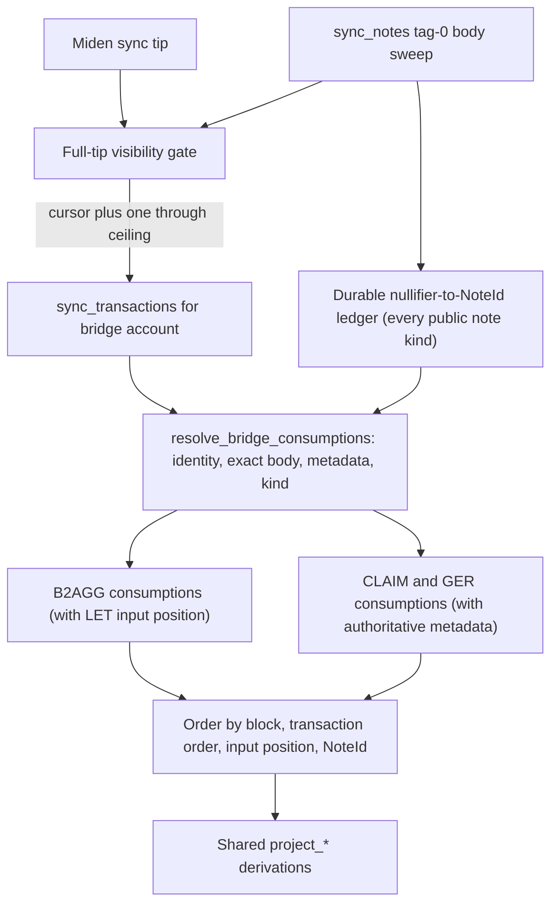

# Unified projector: authoritative consumption sourcing

Status: implemented on `main`; generalized to every event family by issue #167.

This design note explains how `SyntheticProjector` sources consumptions. It
supersedes the former late-consumption sweep and direct-recovery queue, and —
since issue #167 — the former split between an authoritative B2AGG source and
a local-store CLAIM/GER source: there is now ONE resolved-input pipeline for
every event family, so history is rebuilt identically whether it arrives one
tick at a time or in a from-genesis catch-up.

## The consistency problem

The local miden-client store is interest based. An external wallet can create a
public B2AGG note and the network transaction builder can consume it before the
proxy's next `sync_state`. A note-body import sweep can recover the body, but
waiting for the local store to later discover the spend is not a safe basis for
sealing an immutable synthetic block.

CLAIM and GER notes have a different lifecycle — this proxy creates them
through its serialized Miden client and records their receipt linkage — but
their CONSUMPTION is attributed the same way: the bridge account consumes them,
so they appear in the bridge's transaction feed. Relying on the local
consumed-note store for them instead meant that a client-store loss erased
CLAIM/GER history that the node could still serve, and that a from-genesis
rebuild read the whole store on every pass.

## Implemented pipeline

```mermaid
flowchart TD
    TIP["Miden sync tip"]
    SWEEP["sync_notes tag-0 body sweep"]
    CEILING["Full-tip visibility gate"]
    TXS["sync_transactions for bridge account"]
    LEDGER["Durable nullifier-to-NoteId ledger (every public note kind)"]
    RESOLVE["resolve_bridge_consumptions: identity, exact body, metadata, kind"]
    B2AGG["B2AGG consumptions (with LET input position)"]
    INTERNAL["CLAIM and GER consumptions (with authoritative metadata)"]
    ORDER["Order by block, transaction order, input position, NoteId"]
    EMIT["Shared project_* derivations"]

    TIP --> CEILING
    SWEEP --> CEILING
    SWEEP --> LEDGER
    CEILING -->|"cursor plus one through ceiling"| TXS
    TXS --> RESOLVE
    LEDGER --> RESOLVE
    RESOLVE --> B2AGG
    RESOLVE --> INTERNAL
    B2AGG --> ORDER
    INTERNAL --> ORDER
    ORDER --> EMIT
```

Projection waits until `reconcile_cursor >= tip`, then processes through that tip.

`sync_transactions` is filtered to the configured bridge account. For EVERY
consumption it supplies the finalized block number, consuming transaction
order, input nullifiers, input order, and — for public inputs the node can
resolve — the `(nullifier, note_id)` reference. The reconciler's windowed
`sync_notes` sweep persists the nullifier-to-NoteId join for every public note
in the bridge's tag space before advancing its cursor, so a headerless input
still resolves after a client-store loss. The projector accepts a body only
after the per-kind provenance checks pass (B2AGG script + bridge-consumer gate;
CLAIM consumer/mint proof; GER sender/target gate — read from the fetched body's
own metadata, no output-note fallback).

The local consumed-note store is no longer a projection source in either
posture. Live ticks still read it for two self-heal concerns that are not
projection — the synthesized-claim calldata backfill and the completeness
auditor — and restore posture skips both, so a from-genesis catch-up does
window-bounded work per pass.

## Body resolution (every kind)

A consumed external input record no longer exposes the metadata needed to
recompute its nullifier. Before that transition, the reconciler persists the
nullifier-to-NoteId join. Canonical bodies remain in the node.

Resolution order is (issue #167 item 3):

1. NoteId retained by the transaction input header, when the client exposes it;
2. the node's `(nullifier, note_id)` reference for public inputs;
3. durable NoteId recovered by nullifier from the ledger the bounded sweep
   records (the archive lookup for historical / headerless inputs);
4. canonical body — details, attachments, metadata, and the note's own
   nullifier — fetched with `get_notes_by_id`.

Every body is bound to its consumption by its own nullifier before use; a
swapped reference of any kind is refused. The node's transaction feed can
briefly lead its note database. If an identified input is omitted from
`get_notes_by_id`, the projector fails the tick and retries; it never relies on
cardinality after an index may already have been reserved. No synthetic block
is sealed with a missing leaf. The identity ledger is append-only and grows with
observed note history, so restart recovery never depends on cache lifetime or
cleanup ordering. It can contain notes that never emit an event.

An input with NO recoverable identity — no reference, no ledger entry — is the
ERASED-note boundary. Live posture skips it (a hidden bridge-out still fails
closed at the LET cardinality gate); restore posture halts before sealing,
naming the block and nullifier, so a node/protocol limitation is exposed rather
than papered over.

## Bootstrap state

Chain-derived bootstrap state is rebuilt through a normal primitive before the
first dependent event projects: in restore posture the projector runs
`faucet_bootstrap::rebuild_missing_faucet_identities` at the start of every
pass (fail-closed on an unknown faucet type or a failed rebuild) and refuses to
project a bridge-out whose faucet is still unknown. Live posture never adopts an
unknown bridge faucet — that is a security signal, see
`faucet_registry_reconciler`.

## Removed behavior

The live projector no longer:

- projects notes from an earlier sealed Miden block into a later synthetic
  block;
- treats the local B2AGG consumed-note feed as authoritative;
- runs a late-consumption sweep;
- maintains a separate direct-recovered event queue; or
- advances a consumption-reconciliation frontier from the note-creation feed.

The note sweep remains, but only as a body-availability frontier. Holding the
tip at that frontier preserves exact-block `eth_getLogs` behavior.

## Operational checks

`projector_visibility_barrier_held_blocks` shows how far projection is held
behind the Miden tip. The completeness auditor periodically checks older
consumed B2AGG notes against exact-block logs and de-duplicates alarms in
memory. It is detection only and never repairs an exposed block.

The pre-seal LET cardinality gate is the production correctness gate. The
node-versus-log verifier and isolated-wallet load test provide independent checks.

## ORDER + EMIT are code, not convention (2026-08-13)

The ORDER stage is implemented ONCE, in `src/projection_order.rs`
(`ProjectionOrder::key`), and the per-block EMIT dispatch ONCE, in
`projection::BlockProjection::project_block`. The live tick
(`SyntheticProjector::project_block_notes`) and `--restore` (issue #167) are
thin wrappers over the same units — the live wrapper adds block-metadata lookup,
the emitted-frontier gate and the seal; `--restore` is reset-to-genesis +
`catch_up_to(CatchUpMode::Restore)`, the same path under a blocking,
fail-closed schedule. The former node-recovery conversion/replay wrapper was
deleted.

Do not add a second comparator or a second dispatch loop. The comparator copies
drifted three times before this extraction (kind-major replay #100; a
consumption-order tiebreak, reverted; a creation-order tiebreak, deleted), each
drift re-chaining restored UpdateHashChain history — the measured incidents are
catalogued in `projection_order`'s module docs.
