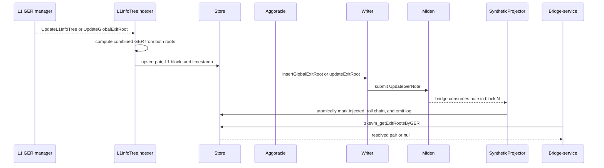

# Global exit root decomposition

Status: current behavior on `main`.

Aggoracle may submit either `insertGlobalExitRoot(bytes32)` or
`updateExitRoot(bytes32,bytes32)`. Both RPC selectors are decoded into the
combined global exit root that the proxy places in an `UpdateGerNote`.
Bridge-service also needs the individual mainnet and rollup roots for
`zkevm_getExitRootsByGER`.

The combined value is one-way:

`GER = keccak256(mainnetExitRoot || rollupExitRoot)`

The proxy therefore learns the pair from L1 events, not by trying to reverse
the hash or by reading whichever pair happens to be latest when the signed GER
transaction arrives.

## Current data flow

`L1InfoTreeIndexer` polls the configured L1 GER contract for both event names
used by supported contract versions. It persists a cursor, re-reads a 64-block
reorg margin after restart, and processes at most 1,000 blocks per poll.

The indexer and projector can arrive in either order:

- If the L1 event arrives first, the indexer creates the row with both roots.
  The later projector commit preserves those roots while marking the GER
  injected and emitting `UpdateHashChainValue`.
- If Miden projection arrives first, the GER row initially has unresolved
  roots. The indexer's upsert fills them when it observes the L1 event.

`is_ger_injected` is separate from “a GER row exists.” This distinction is
required because the indexer can observe an L1 pair before its GER has been
applied on the Miden bridge.

## RPC behavior

`zkevm_getExitRootsByGER` returns a value only when both roots are present. An
unknown GER, a partially populated row, or a fully unresolved row returns JSON
`null`. It never substitutes zero roots.

The successful response contains the L1 event block number and timestamp plus
the mainnet and rollup roots. The projector's synthetic block number is not
used as the L1 evidence location.

## Configuration and backfill

The indexer starts only when both `L1_RPC_URL` and `GER_L1_ADDRESS` are set.
Fresh deployments without a persisted cursor begin at the current L1 head.
Existing deployments resume from their cursor with the reorg margin.

If historic unresolved rows predate the cursor, start one boot with
`L1_INDEXER_FROM_BLOCK=<L1 block>`. The override forces a forward re-read from
that L1 block. Remove it after the cursor has advanced beyond the backfill.

Without the indexer, newly projected GERs can remain unresolved and
`zkevm_getExitRootsByGER` will continue returning `null`; there is no current
latest-root view-call fallback.

## Verification

`scripts/e2e-ger-decomposition.sh` checks resolved, unresolved, partial, and
unknown GER responses. `scripts/e2e-ger-atomic-commit.sh` covers idempotent GER
hash-chain and log commits across restart.
