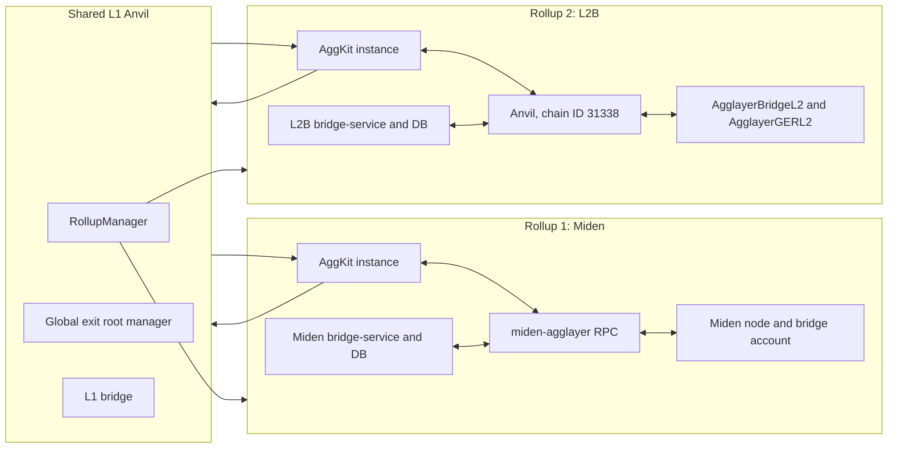

# L2-to-L2 end-to-end test

Status: implemented on `main`.

The `l2l2` test group exercises a round trip between Miden and a second
sovereign EVM rollup named L2B. L2B uses Anvil as its execution node for the
test harness; it is not an OP Stack node. The AggLayer contracts and
registration path are the real sovereign v12 flow.

## Topology



The two bridge-service instances and PostgreSQL databases are isolated by
rollup. Cross-L2 claims are client submitted: the test obtains a proof from the
source rollup's bridge-service and sends `claimAsset` to the destination.

`scripts/setup-l2b.sh` registers chain ID 31338 as rollup/network ID 2 through
`deployment/v2/4_createRollup.ts` in the pinned
`agglayer-contracts:v12.2.3` image. It generates the sovereign genesis and
injects the real `AgglayerBridgeL2` and `AgglayerGERL2` code and storage into
the live L2B Anvil instance. The setup is idempotent.

Generated L2B configs are intentionally not committed. `make
gen-l2b-configs` derives them from the base fixtures, and `make e2e-l2l2-up`
runs that target automatically.

## Run the group

Prerequisites are the same host tools and locally built images described in
[`RUNNING-E2E.md`](RUNNING-E2E.md).

```sh
make e2e-l2l2-up
make e2e-l2l2
make e2e-l2l2-down
```

`e2e-l2l2-up` starts the base stack plus
`docker-compose.l2l2.yml`, waits for L2B, registers rollup 2, deploys the
sovereign contracts, and recreates the network-2 services after registration.

`e2e-l2l2` runs these scripts in order:

1. `scripts/e2e-l2l2-forward.sh` deploys an 18-decimal token on L2B, bridges
   it to Miden, waits for certificate settlement and GER propagation, submits
   a proof-backed claim, and checks the origin-network-2 faucet, balance, and
   `ClaimEvent`.
2. `scripts/e2e-l2l2-clash.sh` deploys tokens at the same 20-byte address on
   L1 and L2B, bridges both to Miden, and proves the `(origin address, origin
   network)` keys produce distinct faucets and balances.
3. `scripts/e2e-l2l2-back.sh` burns the wrapped L2B token on Miden, settles a
   certificate, submits a proof-backed claim on L2B, and verifies the original
   L2B balance is restored and the Miden wrapped balance returns to baseline.

The forward leg writes scenario state under
`.b2agg-store/e2e-l2l2`; the clash and back legs intentionally consume that
same state. Run the full group when starting from a clean stack. Individual
filters (`l2l2-forward`, `l2l2-clash`, and `l2l2-back`) are available through
`scripts/e2e-test.sh` for focused debugging, subject to their documented state
preconditions.

## GER propagation

L2B exit roots reach Miden only after Aggsender submits and AggLayer settles a
certificate, L1 updates the combined GER, and Miden's aggoracle injects it.
When L2B is otherwise quiet, the harness creates a one-wei nudge deposit to
force the next certificate cycle. Claim predicates fetch a fresh proof while
waiting for the covering GER rather than reusing an old proof.

Claims sent to the Miden proxy use a legacy transaction with an explicit gas
price and gas limit because the synthetic RPC does not implement
`eth_feeHistory` and `eth_estimateGas` is compatibility-oriented. Claims sent
to L2B use its normal Anvil fee path.

## Evidence and assertions

The group writes a per-run NDJSON audit trail under `.l2l2-evidence`. It records
deployments, deposits, GER injections, claims, certificate settlements, rollup
registration, and exit-root movement. Missing required evidence is a hard test
failure.

Assertions use on-chain state, proxy PostgreSQL state, bridge-service APIs,
and transaction receipts. Container-log matching is used only where there is
no stronger state query. The optional Miden-origin scenarios are
`DEST=l2b scripts/e2e-miden-origin.sh` and
`DEST=l1 scripts/e2e-miden-origin.sh`.
