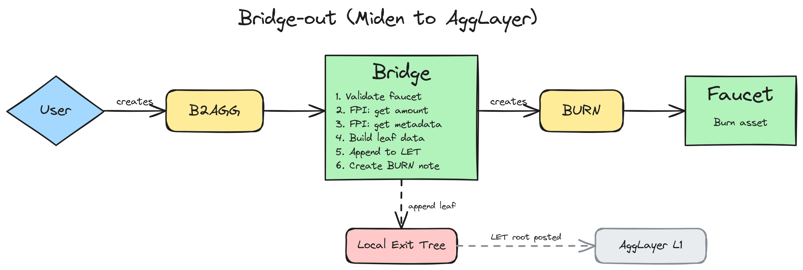
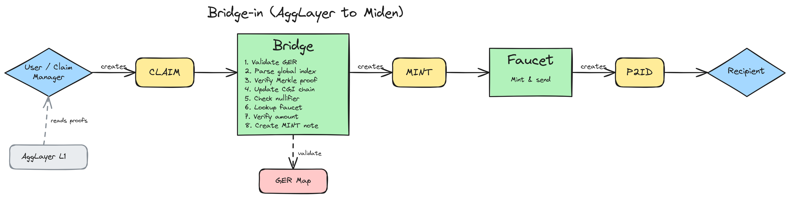
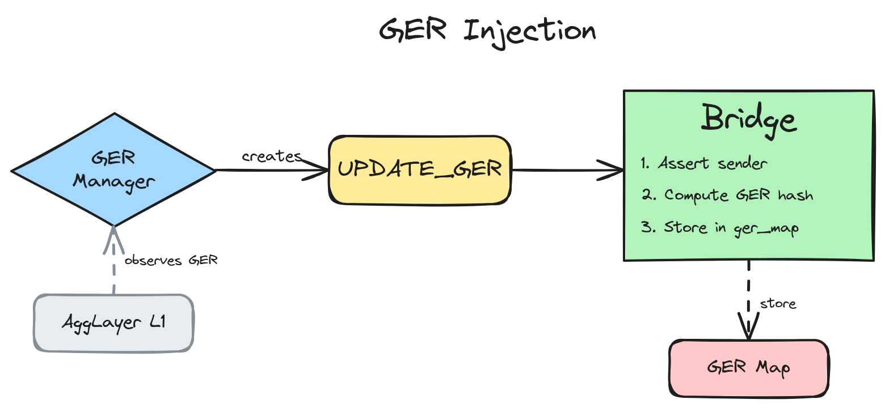
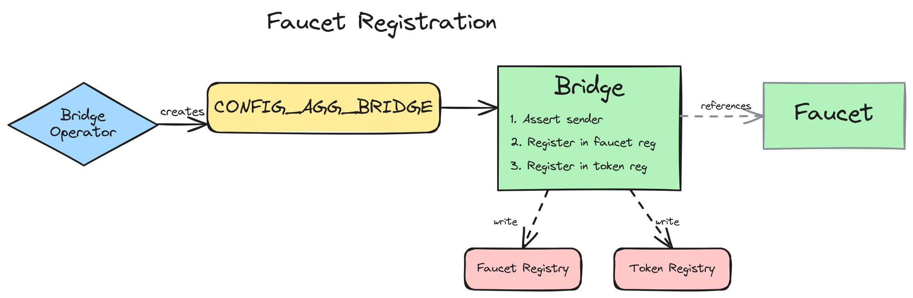

# AggLayer <> Miden Bridge Integration Specification

**Scope:** Implementation-accurate specification of the AggLayer bridge integration on
Miden, covering contracts, note flows, storage, and encoding semantics.

**Baseline:** Branch `agglayer` (to-be-tagged `v0.14-alpha`). All statements in sections 1-3 describe
current implementation behaviour and are cross-checked against the test suite in
`crates/miden-testing/tests/agglayer/`. Planned changes that diverge from the current
implementation are called out inline with `TODO (Future)` markers.

**Conventions:**

- *Word* = 4 field elements (felts), each < p (Goldilocks prime 2^64 - 2^32 + 1).
- *Felt* = a single Goldilocks field element.

---

## 1. Entities and Trust Model

| Entity | Description | Account type |
|--------|-------------|--------------|
| **User** | End-user Miden account that holds assets and initiates bridge-out deposits, or receives assets from a bridge-in claim. | Any account with `basic_wallet` component |
| **AggLayer Bridge** | Onchain bridge account that manages the Local Exit Tree (LET), faucet registry, and GER state. Consumes B2AGG, CONFIG, and UPDATE_GER notes. | Network-mode account with a single `bridge` component |
| **AggLayer Faucet** | Fungible faucet that represents a single bridged token. Mints on bridge-in claims, burns on bridge-out. Each foreign token has its own faucet instance. | `FungibleFaucet`, network-mode, with `agglayer_faucet` component |
| **Integration Service** (offchain) | Observes L1 events (deposits, GER updates) and creates UPDATE_GER and CLAIM notes on Miden. Trusted to provide correct proofs and data. | Not an onchain entity; creates notes targeting bridge/faucet |
| **Bridge Operator** (offchain) | Deploys bridge and faucet accounts. Creates CONFIG_AGG_BRIDGE notes to register faucets. Must use the bridge admin account. | Not an onchain entity; creates config notes |

---

## 2. Protocol Description

The crate `miden-agglayer` implements the AggLayer bridging protocol on the Miden blockchain. This section provides a high-level description of the implementation on Miden, covering the main operational flows.

### 2.1 Bridge-out (Miden to AggLayer)



A user initiates a bridge-out by creating a [`B2AGG`](#41-b2agg) note containing a single fungible
asset and the destination network/address. The bridge account consumes this note:

1. Validates that the asset's faucet is registered in the faucet registry, and that the
   destination network is not Miden's AggLayer network ID.
2. Reads conversion metadata (origin token address, origin network, scale) for the asset's
   faucet from the bridge's local `faucet_metadata_map`. No FPI into the faucet is required;
   metadata was written to the map at registration time.
3. Reads the precomputed metadata hash for the same faucet from `faucet_metadata_map`.
4. Constructs a leaf-data structure (leaf type, origin network, origin token address,
   destination network, destination address, amount, metadata hash).
5. Computes the Keccak-256 leaf value and appends it to the Local Exit Tree (LET).
6. Dispatches on the faucet's `is_native` flag (also read from the registry):
   - **Wrapped faucet (`is_native = false`):** the bridge does not hold the asset onchain; it
     emits a public [`BURN`](#45-burn-generated) note targeting the faucet, which the faucet
     consumes to burn the asset and decrement the faucet's token supply.
   - **Miden-native faucet (`is_native = true`):** the bridge does not hold mint/burn authority
     for the faucet, so it cannot emit a `BURN`. Instead it locks the asset by adding it to
     the bridge's own vault (`native_account::add_asset`); a later bridge-in claim for the
     same token can pay out from this locked balance.

The leaf appended to the LET can later be included in a Merkle proof on any
AggLayer-connected chain to claim the bridged asset.

TODO: The bridge currently has no emergency pause mechanism to halt operations
([#2696](https://github.com/0xMiden/protocol/issues/2696)).

### 2.2 Bridge-in (AggLayer to Miden)



When a new deposit into Miden is made on an AggLayer-connected chain, Miden needs to be "informed" of the updated AggLayer state by having a new Global Exit Root (GER) injected - see [Section 2.3](#23-ger-injection).

Once the GER is injected, any user can initiate the claim process by creating a [`CLAIM`](#42-claim) note on Miden containing Merkle proofs and leaf data (by monitoring updates to the AggLayer contract on Ethereum L1). This will typically be done by a claim manager service for convenience, but is permissionless and open to any user.
The `CLAIM` note is consumed by the bridge account:

1. Validates the Global Exit Root (GER) is known in the bridge's `ger_map`.
2. Parses the global index to determine whether this is a mainnet or rollup deposit,
   and extracts the leaf index and source bridge network.
3. Verifies the Merkle proof: for mainnet deposits, a single proof against
   `mainnet_exit_root`; for rollup deposits, a two-level proof (leaf against
   `local_exit_root`, then `local_exit_root` against `rollup_exit_root`).
4. Updates the claimed global index (CGI) chain hash:
   `NEW_CGI = Keccak256(OLD_CGI, Keccak256(GLOBAL_INDEX, LEAF_VALUE))`.
5. Checks and sets the claim nullifier to prevent double-claiming.
6. Looks up the faucet from the `(origin_token_address, origin_network)` pair via the token
   registry.
7. Verifies the claim amount against the leaf's U256 amount and the faucet's scale factor.
8. Dispatches on the faucet's `is_native` flag:
   - **Wrapped faucet (`is_native = false`):** the bridge emits a [`MINT`](#47-mint-generated)
     note targeting the faucet. The faucet consumes the `MINT` note, mints the specified amount,
     and creates a [`P2ID`](#46-p2id-generated) note delivering the minted assets to the
     recipient's Miden account.
   - **Miden-native faucet (`is_native = true`):** the bridge cannot mint via the faucet, so
     it removes the asset from its own vault (`native_account::remove_asset`) and emits a
     `P2ID` note targeted at the recipient directly. The asset must have been previously
     locked into the bridge by a prior bridge-out for the same token.

Inside `bridge_in::claim`, immediately after proof and leaf data are piped into memory, the bridge asserts the leaf's `destination_network` equals the global MASM constant `MIDEN_NETWORK_ID` in `asm/agglayer/common/constants.masm` (after `swap_u32_bytes` on the LE-packed memory limb). The same value is exposed to Rust as `AggLayerBridge::MIDEN_NETWORK_ID`, matching Solidity test vectors.
This mirrors Solidity `claimAsset` destination-network checks.

TODO: The leaf type field is not validated to be `LEAF_TYPE_ASSET` (0)
([#2699](https://github.com/0xMiden/protocol/issues/2699)).

TODO: Claims cannot be reversed once the nullifier is set
([#2703](https://github.com/0xMiden/protocol/issues/2703)).

### 2.3 GER Injection



Global Exit Roots represent a snapshot of exit tree roots across all AggLayer-connected
chains. A GER Manager observes L1 GER updates and creates [`UPDATE_GER`](#44-update_ger) notes
on Miden. The bridge consumes these notes:

1. Asserts the note sender is the designated GER manager.
2. Computes `KEY = poseidon2::merge(GER_LOWER, GER_UPPER)`.
3. Stores `KEY -> [1, 0, 0, 0]` in the `ger_map`, marking the GER as known.
4. Reverts if the GER was already present in the map (duplicate insertions are rejected).

Subsequent CLAIM notes reference a GER that must be present in this map for the claim
to be valid.

> **Note on Solidity divergence:** The Solidity `GlobalExitRootManager` contract treats a
> duplicate GER insertion as an idempotent no-op. Miden intentionally diverges: a duplicate
> `UPDATE_GER` note causes the consuming transaction to revert. Because `UPDATE_GER` is a
> network note (consumed by the note nullifier mechanism), a duplicate would become
> permanently unconsumable rather than silently accepted. Rejecting duplicates makes the
> failure explicit and prevents the GER manager from accidentally creating unconsumed notes.

TODO: GERs cannot be removed once inserted
([#2702](https://github.com/0xMiden/protocol/issues/2702)).

TODO: No hash chain tracks GER insertions for proof generation
([#2707](https://github.com/0xMiden/protocol/issues/2707)).

### 2.4 Faucet Registration



Each bridged token (wrapped or Miden-native) requires registration in the bridge's
registries. The Bridge Operator creates [`CONFIG_AGG_BRIDGE`](#43-config_agg_bridge) notes
carrying the faucet's account ID, the origin token address, the origin network, the scale
factor, the metadata hash, and an `is_native` flag. The bridge consumes the note (asserting
the sender is the bridge admin) and runs two calls back-to-back:

- `bridge_config::register_faucet` writes the registration flag plus `is_native` into
  `faucet_registry_map`, the conversion metadata into `faucet_metadata_map` (sub-keys 0 and
  1), and the `(origin_token_address, origin_network) → faucet_id` mapping into
  `token_registry_map`.
- `bridge_config::store_faucet_metadata_hash` writes the precomputed metadata hash into
  `faucet_metadata_map` (sub-keys 2 and 3).

The split is necessary because the 16-element MASM stack cannot fit all 18 registration
felts at once. For a detailed description of the registries, see
[Section 7](#7-faucet-registry).

TODO: Faucet registrations are permanent; no remapping or deregistration is supported
([#2704](https://github.com/0xMiden/protocol/issues/2704),
[#2705](https://github.com/0xMiden/protocol/issues/2705)).

TODO: Faucet existence and code commitment are not validated during registration
([#2709](https://github.com/0xMiden/protocol/issues/2709)).

### 2.5 Administration

The bridge has two administrative roles set at account creation time:

- **Bridge admin** (`admin_account_id`): authorizes faucet registration via
  [`CONFIG_AGG_BRIDGE`](#43-config_agg_bridge) notes.
- **GER manager** (`ger_manager_account_id`): authorizes GER updates via [`UPDATE_GER`](#44-update_ger)
  notes.

Both roles are verified by checking the note sender against the stored account ID.

TODO: Administrative roles cannot be transferred after account creation
([#2706](https://github.com/0xMiden/protocol/issues/2706)).

TODO: No emergency pause mechanism exists
([#2696](https://github.com/0xMiden/protocol/issues/2696)).

---

## 3. Contracts and Public Interfaces

### 3.1 Bridge Account Component

The bridge account has a single unified `bridge` component (`components/bridge.masm`),
which is a thin wrapper that re-exports procedures from the `agglayer` library modules:

- `bridge_config::register_faucet`
- `bridge_config::update_ger`
- `bridge_in::claim`
- `bridge_out::bridge_out`

The underlying library code lives in `asm/agglayer/bridge/` with supporting modules in
`asm/agglayer/common/`.

#### `bridge_out::bridge_out`

| | |
|-|-|
| **Invocation** | `call` |
| **Inputs** | `[ASSET, dest_network_id, dest_addr(5), pad(4)]` |
| **Outputs** | `[]` |
| **Context** | Consuming a `B2AGG` note on the bridge account |
| **Panics** | Faucet not in registry; FPI to faucet fails |

Bridges an asset out of Miden into the AggLayer:

1. Validates the asset's faucet is registered in the faucet registry.
2. FPIs to `agglayer_faucet::asset_to_origin_asset` on the faucet account to obtain the scaled U256 amount, origin token address, and origin network.
3. Builds a leaf-data structure in memory (leaf type, origin network, origin token address, destination network, destination address, amount, metadata hash).
4. Computes the Keccak-256 leaf value and appends it to the Local Exit Tree.
5. Creates a public `BURN` note targeting the faucet via a `NetworkAccountTarget` attachment.

#### `bridge_config::register_faucet`

| | |
|-|-|
| **Invocation** | `call` |
| **Inputs** | `[origin_token_addr(5), origin_network, faucet_id_suffix, faucet_id_prefix, pad(8)]` |
| **Outputs** | `[pad(16)]` |
| **Context** | Consuming a `CONFIG_AGG_BRIDGE` note on the bridge account |
| **Panics** | Note sender is not the bridge admin |

Asserts the note sender matches the bridge admin stored in
`agglayer::bridge::admin_account_id`, then performs a two-step registration:

1. Writes `[0, 0, faucet_id_suffix, faucet_id_prefix] -> [1, 0, 0, 0]` into the
   `faucet_registry_map` map slot.
2. Hashes `origin_token_addr` (5 felts) together with `origin_network` (1 felt) using
   `Poseidon2::hash_elements` and writes
   `hash(origin_token_addr, origin_network) -> [0, 0, faucet_id_suffix, faucet_id_prefix]`
   into the `token_registry_map` map slot. The `(origin_network, origin_token_address)`
   pair is the canonical asset identity (matching the Solidity `tokenInfoHash`); keying on
   the address alone would let a CLAIM bound to one origin network resolve to the faucet of
   the same address on another network.

#### `bridge_config::update_ger`

| | |
|-|-|
| **Invocation** | `call` |
| **Inputs** | `[GER_LOWER(4), GER_UPPER(4), pad(8)]` |
| **Outputs** | `[pad(16)]` |
| **Context** | Consuming an `UPDATE_GER` note on the bridge account |
| **Panics** | Note sender is not the GER manager; GER has already been registered in storage |

Asserts the note sender matches the GER manager stored in
`agglayer::bridge::ger_manager_account_id`, then computes
`KEY = poseidon2::merge(GER_LOWER, GER_UPPER)` and stores
`KEY -> [1, 0, 0, 0]` in the `ger_map` map slot. This marks the GER as "known".
Duplicate insertions (same GER value) are explicitly rejected: if the key already exists
in the map the procedure panics with `ERR_GER_ALREADY_REGISTERED`.

#### `bridge_in::claim`

| | |
|-|-|
| **Invocation** | `call` |
| **Inputs** | `[PROOF_DATA_KEY, LEAF_DATA_KEY, faucet_mint_amount, pad(7)]` on the operand stack; proof data and leaf data in the advice map keyed by `PROOF_DATA_KEY` and `LEAF_DATA_KEY` respectively |
| **Outputs** | `[pad(16)]` |
| **Context** | Consuming a `CLAIM` note on the bridge account |
| **Panics** | Leaf `destination_network` does not match `agglayer::common::constants::MIDEN_NETWORK_ID`; invalid leaf type; GER not known; global index invalid; Merkle proof verification failed; (origin token address, origin network) pair not in token registry; claim already spent; amount conversion mismatch |

Validates a bridge-in claim and creates a MINT note targeting the faucet:

1. Pipes proof data and leaf data from the advice map into memory, verifying preimage
   integrity, then asserts the leaf's `destination_network` matches the global
   `MIDEN_NETWORK_ID` constant (`asm/agglayer/common/constants.masm`) after `swap_u32_bytes` on
   the LE-packed limb (same convention as other AggLayer bridge-in u32 felts in memory).
2. Extracts the destination account ID from the leaf data's destination address
   (via `eth_address::to_account_id`).
3. Validates the Merkle proof via `verify_leaf_bridge`: computes the leaf
   value from leaf data, computes the GER from mainnet + rollup exit roots, asserts
   GER is known, processes global index (mainnet or rollup), verifies Merkle proof.
   For mainnet: single proof against `mainnet_exit_root`. For rollup: two-level proof
   (leaf against `local_exit_root`, then `local_exit_root` against `rollup_exit_root`, though the first check is implicit).
4. Updates the claimed global index (CGI) chain hash:
   `NEW_CGI = Keccak256(OLD_CGI, Keccak256(GLOBAL_INDEX, LEAF_VALUE))`.
5. Computes and checks the claim nullifier
   `Poseidon2::hash_elements(leaf_index, source_bridge_network)` to prevent
   double-claiming. For mainnet deposits, `source_bridge_network = 0`. For rollup
   deposits, `source_bridge_network = rollup_index + 1`.
6. Looks up the faucet account ID from the `(origin_token_address, origin_network)` pair via
   `bridge_config::lookup_faucet_by_token_address`. Resolving by the full pair (rather than the
   address alone) prevents same-address cross-network collisions where a CLAIM proven on one
   origin network could resolve to a faucet registered on another.
7. Verifies the `faucet_mint_amount` against the leaf data's U256 amount and the
   faucet's scale factor (via FPI to `agglayer_faucet::get_scale`), using
   `asset_conversion::verify_u256_to_native_amount_conversion`.
8. Builds a MINT output note targeting the faucet (see [Section 4.7](#47-mint-generated)).

#### Bridge Account Storage

| Slot name | Slot type | Key encoding | Value encoding | Purpose |
|-----------|-----------|-------------|----------------|---------|
| `agglayer::bridge::ger_map` | Map | `poseidon2::merge(GER_LOWER, GER_UPPER)` | `[1, 0, 0, 0]` if known | Known Global Exit Root set |
| `agglayer::bridge::let_frontier` | Map | `[h, 0, 0, 0]` and `[h, 1, 0, 0]` (for h = 0..31) | Per index h: two keys yield one double-word (2 words = 8 felts, a Keccak-256 digest). | Local Exit Tree |
| `agglayer::bridge::let_root_lo` | Value | -- | Lower word of the LET root | LET root low word (Keccak-256 lower 16 bytes) |
| `agglayer::bridge::let_root_hi` | Value | -- | Upper word of the LET root | LET root high word (Keccak-256 upper 16 bytes) |
| `agglayer::bridge::let_num_leaves` | Value | -- | `[count, 0, 0, 0]` | Number of leaves appended to the LET |
| `agglayer::bridge::faucet_registry_map` | Map | `[0, 0, faucet_id_suffix, faucet_id_prefix]` | `[1, 0, 0, 0]` if registered | Registered faucet lookup |
| `agglayer::bridge::token_registry_map` | Map | `Poseidon2::hash_elements(origin_token_addr[5] \|\| origin_network)` | `[0, 0, faucet_id_suffix, faucet_id_prefix]` | (Origin token address, origin network) to faucet ID lookup |
| `agglayer::bridge::claim_nullifiers` | Map | `Poseidon2::hash_elements(leaf_index, source_bridge_network)` | `[1, 0, 0, 0]` if claimed | Prevents double-claiming of bridge-in deposits |
| `agglayer::bridge::cgi_chain_hash_lo` | Value | -- | Lower word of the CGI chain hash | CGI chain hash low word (Keccak-256 lower 16 bytes) |
| `agglayer::bridge::cgi_chain_hash_hi` | Value | -- | Upper word of the CGI chain hash | CGI chain hash high word (Keccak-256 upper 16 bytes) |
| `agglayer::bridge::admin_account_id` | Value | -- | `[0, 0, admin_suffix, admin_prefix]` | Bridge admin account ID for CONFIG note authorization |
| `agglayer::bridge::ger_manager_account_id` | Value | -- | `[0, 0, mgr_suffix, mgr_prefix]` | GER manager account ID for UPDATE_GER note authorization |

Initial state: all map slots empty, all value slots `[0, 0, 0, 0]` except
`admin_account_id` and `ger_manager_account_id` (set at account creation time).

### 3.2 Faucet Account Component

The faucet account has the `agglayer_faucet` component (`components/faucet.masm`),
which is a thin wrapper that re-exports procedures from the `agglayer` library:

- `faucet::mint_and_send`
- `faucet::asset_to_origin_asset`
- `faucet::get_metadata_hash`
- `faucet::get_scale`
- `faucet::burn`

The underlying library code lives in `asm/agglayer/faucet/mod.masm` with supporting
modules in `asm/agglayer/common/`.

#### `agglayer_faucet::mint_and_send`

| | |
|-|-|
| **Invocation** | `call` |
| **Inputs** | `[ASSET_KEY, ASSET_VALUE, tag, note_type, RECIPIENT, pad(2)]` |
| **Outputs** | `[note_idx, pad(15)]` |
| **Context** | Consuming a `MINT` note on the faucet account |
| **Panics** | Faucet owner verification fails; minting exceeds supply; the asset stored in the MINT note does not belong to the consuming faucet |

Re-export of `miden::standards::faucets::fungible::mint_and_send`. Mints the asset
identified by `ASSET_KEY` / `ASSET_VALUE` and creates an output note with the given
recipient. Requires the faucet's owner (the bridge account) to be the creator of this note
(the bridge is stored in `Ownable2Step` storage slot as the owner; the faucet's
`mint_and_send` executes the current access policy via
`exec.policy_manager::execute_mint_policy`). `mint_and_send` then derives the asset to mint
for the active faucet and panics if the stored `ASSET_KEY` does not belong to that faucet,
which binds the MINT note to its resolved faucet (see §4.7).

#### `agglayer_faucet::get_metadata_hash`

| | |
|-|-|
| **Invocation** | `call` |
| **Inputs** | `[pad(16)]` |
| **Outputs** | `[METADATA_HASH_LO, METADATA_HASH_HI, pad(8)]` |
| **Context** | FPI target - called by the bridge during bridge-out |

Reads the pre-computed metadata hash from the two faucet storage slots
(`metadata_hash_lo`, `metadata_hash_hi`) and returns it as 8 u32 felts.

#### `agglayer_faucet::get_scale`

| | |
|-|-|
| **Invocation** | `call` |
| **Inputs** | `[pad(16)]` |
| **Outputs** | `[scale, pad(15)]` |
| **Context** | FPI target - called by the bridge during bridge-in claim amount verification |

Reads the scale factor from the `conversion_info_2` storage slot and returns it.

#### `agglayer_faucet::asset_to_origin_asset`

| | |
|-|-|
| **Invocation** | `call` (invoked via FPI from the bridge) |
| **Inputs** | `[amount, pad(15)]` |
| **Outputs** | `[AMOUNT_U256_0(4), AMOUNT_U256_1(4), addr(5), origin_network, pad(2)]` |
| **Context** | FPI target -- called by the bridge during bridge-out |
| **Panics** | Scale exceeds 18 |

Converts a Miden-native asset amount to the origin chain's U256 representation:

1. Reads the scale from storage, calls `asset_conversion::scale_native_amount_to_u256`.
2. Since `scale_native_amount_to_u256` operates on BE bytes, and Keccak expects LE, the procedure calls `reverse_limbs_and_change_byte_endianness`
3. Returns the origin token address and origin network from storage.

#### `agglayer_faucet::burn`

This is a re-export of `miden::standards::faucets::fungible::burn`. It burns the fungible asset from the active note, decreasing the faucet's token supply.

| | |
|-|-|
| **Invocation** | `call` |
| **Inputs** | `[pad(16)]` |
| **Outputs** | `[pad(16)]` |
| **Context** | Consuming a `BURN` note on the faucet account |
| **Panics** | Note context invalid; asset count wrong; faucet/supply checks fail |

#### Faucet Account Storage

| Slot name | Slot type | Value encoding | Purpose |
|-----------|-----------|----------------|---------|
| Faucet metadata (standard) | Value | `[token_supply, max_supply, decimals, token_symbol]` | Standard `NetworkFungibleFaucet` metadata |
| `agglayer::faucet::conversion_info_1` | Value | `[addr_0, addr_1, addr_2, addr_3]` | Origin token address, first 4 u32 limbs |
| `agglayer::faucet::conversion_info_2` | Value | `[addr_4, origin_network, scale, 0]` | Origin token address 5th limb, origin network ID, scale exponent |
| `agglayer::faucet::metadata_hash_lo` | Value | Lower word of the metadata hash | Metadata hash low word (4 u32 felts) |
| `agglayer::faucet::metadata_hash_hi` | Value | Upper word of the metadata hash | Metadata hash high word (4 u32 felts) |

**Companion component storage slots:** The faucet account also includes storage from
companion components required by `fungible::mint_and_send`:

- `Ownable2Step` owner config slot: stores the bridge account ID as owner.
- `OwnerControlled` slots (3): `active_policy_proc_root`, `allowed_policy_proc_roots`,
  `policy_authority`.

---

## 4. Note Types and Storage Layouts

**Encoding conventions:** All multi-byte values in note storage (addresses, U256
integers, Keccak-256 hashes) are encoded as arrays of u32 felts via
`bytes_to_packed_u32_felts`: big-endian limb order with **little-endian byte order**
within each 4-byte limb (see [Section 6.5](#65-endianness-summary)). Scalar u32 fields
(network IDs) are byte-reversed at storage time so their in-memory bytes align with the
Keccak preimage format directly — the felt value does **not** equal the numeric value
(e.g., chain ID `1` = `0x00000001` is stored as felt `0x01000000`).

### 4.1 B2AGG
(Bridge-to-AggLayer)

**Purpose:** User bridges an asset from Miden to the AggLayer.

**`NoteHeader`**

*`NoteMetadata`:*

| Field | Value |
|-------|-------|
| `sender` | Any account (not validated) |
| `note_type` | `NoteType::Public` |
| `tag` | `NoteTag::default()` |
| `attachment` | `NetworkAccountTarget` -- target is the bridge account; execution hint: Always |

**`NoteDetails`**

*`NoteAssets`:* Exactly 1 fungible asset.

*`NoteRecipient`:*

| Field | Value |
|-------|-------|
| `serial_num` | Random (`rng.draw_word()`) |
| `script` | `b2agg.masm` |
| `storage` | 6 felts -- see layout below |

**Storage layout (6 felts):**

| Index | Field | Encoding |
|-------|-------|----------|
| 0 | `destination_network` | u32 |
| 1-5 | `destination_address` | 5 x u32 felts (20-byte Ethereum address) |

**Consumption:**

- **Bridge-out:** Consuming account is the bridge -> note validates attachment target,
  loads storage and asset, calls `bridge_out::bridge_out`.
- **Reclaim:** Consuming account is the original sender -> assets are added back to the
  account via `basic_wallet::add_assets_to_account`. No output notes.

#### Permissions

**Bridge-out:**

| Role | Enforcement |
|------|------------|
| **Issuer** | Any user -- not restricted |
| **Consumer** | Bridge account -- **enforced** via `NetworkAccountTarget` attachment |

**Reclaim:**

| Role | Enforcement |
|------|------------|
| **Issuer** | Any user -- not restricted |
| **Consumer** | Original sender only -- **enforced**: script checks `sender == consuming account` |

### 4.2 CLAIM

**Purpose:** Claim assets, which were deposited on any AggLayer-connected rollup, on Miden.
Consumed by the bridge account, which validates the proof, looks up the faucet via the
token registry, and creates a MINT note targeting the faucet.

**`NoteHeader`**

*`NoteMetadata`:*

| Field | Value |
|-------|-------|
| `sender` | Any account (not validated) |
| `note_type` | `NoteType::Public` |
| `tag` | `NoteTag::default()` |
| `attachment` | `NetworkAccountTarget` -- target is the bridge account; execution hint: Always |

**`NoteDetails`**

*`NoteAssets`:* None (empty).

*`NoteRecipient`:*

| Field | Value |
|-------|-------|
| `serial_num` | Random (`rng.draw_word()`) |
| `script` | `claim.masm` |
| `storage` | 569 felts -- see layout below |

**Storage layout (569 felts):**

The storage is divided into three logical regions: proof data (felts 0-535), leaf data
(felts 536-567), and the native claim amount (felt 568).

| Range | Field | Size (felts) | Encoding |
|-------|-------|-------------|----------|
| 0-255 | `smt_proof_local_exit_root` | 256 | 32 x Keccak-256 nodes (8 felts each) |
| 256-511 | `smt_proof_rollup_exit_root` | 256 | 32 x Keccak-256 nodes (8 felts each) |
| 512-519 | `global_index` | 8 | U256 as 8 x u32 felts |
| 520-527 | `mainnet_exit_root` | 8 | Keccak-256 hash as 8 x u32 felts |
| 528-535 | `rollup_exit_root` | 8 | Keccak-256 hash as 8 x u32 felts |
| 536 | `leaf_type` | 1 | u32 (0 = asset) |
| 537 | `origin_network` | 1 | u32 |
| 538-542 | `origin_token_address` | 5 | 5 x u32 felts |
| 543 | `destination_network` | 1 | u32 |
| 544-548 | `destination_address` | 5 | 5 x u32 felts |
| 549-556 | `amount` | 8 | U256 as 8 x u32 felts |
| 557-564 | `metadata_hash` | 8 | Keccak-256 hash as 8 x u32 felts |
| 565-567 | padding | 3 | zeros |
| 568 | `miden_claim_amount` | 1 | Scaled-down Miden token amount (Felt). Computed as `floor(amount / 10^scale)` |

**Consumption:**

1. Script asserts consuming account matches the target bridge via `NetworkAccountTarget`
   attachment.
2. All 569 felts are loaded into memory.
3. Proof data and leaf data regions are hashed with Poseidon2 and inserted into the
   advice map as two keyed entries (`PROOF_DATA_KEY`, `LEAF_DATA_KEY`).
4. The `miden_claim_amount` is read from memory.
5. `bridge_in::claim` is called with `[PROOF_DATA_KEY, LEAF_DATA_KEY, miden_claim_amount]`
   on the stack. The bridge asserts the leaf's `destination_network` matches the global
   `MIDEN_NETWORK_ID` MASM constant, validates the proof, checks the claim nullifier, looks up the faucet via the token
   registry, verifies the amount conversion, then builds a MINT output note targeting the faucet.

#### Permissions

| Role | Enforcement |
|------|------------|
| **Issuer** | Anyone -- not restricted |
| **Consumer** | Bridge account -- **enforced** via `NetworkAccountTarget` attachment |

### 4.3 CONFIG_AGG_BRIDGE

**Purpose:** Registers a faucet in the bridge's faucet registry.

**`NoteHeader`**

*`NoteMetadata`:*

| Field | Value |
|-------|-------|
| `sender` | Bridge admin (sender authorization enforced by the bridge's `register_faucet` procedure) |
| `note_type` | `NoteType::Public` |
| `tag` | `NoteTag::default()` |
| `attachment` | `NetworkAccountTarget` -- target is the bridge account; execution hint: Always |

**`NoteDetails`**

*`NoteAssets`:* None (empty).

*`NoteRecipient`:*

| Field | Value |
|-------|-------|
| `serial_num` | Random (`rng.draw_word()`) |
| `script` | `config_agg_bridge.masm` |
| `storage` | 8 felts -- see layout below |

**Storage layout (8 felts):**

| Index | Field | Encoding |
|-------|-------|----------|
| 0-4 | `origin_token_addr` | 5 x u32 felts (20-byte Ethereum address) |
| 5 | `origin_network` | Felt (LE-packed u32 origin network identifier) |
| 6 | `faucet_id_suffix` | Felt (AccountId suffix) |
| 7 | `faucet_id_prefix` | Felt (AccountId prefix) |

**Consumption:** Script validates attachment target, loads storage, and calls
`bridge_config::register_faucet` (which asserts sender is bridge admin and performs
two-step registration into `faucet_registry_map` and `token_registry_map`).

#### Permissions

| Role | Enforcement |
|------|------------|
| **Issuer** | Bridge admin only -- **enforced** by `bridge_config::register_faucet` procedure |
| **Consumer** | Bridge account -- **enforced** via `NetworkAccountTarget` attachment |

### 4.4 UPDATE_GER

**Purpose:** Stores a new Global Exit Root (GER) in the bridge account so that subsequent
CLAIM notes can be verified against it.

**`NoteHeader`**

*`NoteMetadata`:*

| Field | Value |
|-------|-------|
| `sender` | GER manager (sender authorization enforced by the bridge's `update_ger` procedure) |
| `note_type` | `NoteType::Public` |
| `tag` | `NoteTag::default()` |
| `attachment` | `NetworkAccountTarget` -- target is the bridge account; execution hint: Always |

**`NoteDetails`**

*`NoteAssets`:* None (empty).

*`NoteRecipient`:*

| Field | Value |
|-------|-------|
| `serial_num` | Random (`rng.draw_word()`) |
| `script` | `update_ger.masm` |
| `storage` | 8 felts -- see layout below |

**Storage layout (8 felts):**

| Range | Field | Encoding |
|-------|-------|----------|
| 0-3 | `GER_LOWER` | First 16 bytes as 4 x u32 felts |
| 4-7 | `GER_UPPER` | Last 16 bytes as 4 x u32 felts |

**Consumption:** Script validates attachment target, loads storage, and calls
`bridge_config::update_ger` (which asserts sender is GER manager), which computes
`poseidon2::merge(GER_LOWER, GER_UPPER)` and stores the result in the GER map.

#### Permissions

| Role | Enforcement |
|------|------------|
| **Issuer** | GER manager only -- **enforced** by `bridge_config::update_ger` procedure |
| **Consumer** | Bridge account -- **enforced** via `NetworkAccountTarget` attachment |

### 4.5 BURN (generated)

**Purpose:** Created by `bridge_out::bridge_out` to burn the bridged asset on the faucet.

**`NoteHeader`**

*`NoteMetadata`:*

| Field | Value |
|-------|-------|
| `sender` | Bridge account |
| `note_type` | `NoteType::Public` |
| `tag` | `NoteTag::default()` |
| `attachment` | `NetworkAccountTarget` -- target is the faucet account; execution hint: Always |

**`NoteDetails`**

*`NoteAssets`:* The single fungible asset from the originating B2AGG note.

*`NoteRecipient`:*

| Field | Value |
|-------|-------|
| `serial_num` | Derived as `poseidon2::merge(B2AGG_SERIAL_NUM, ASSET_KEY)` |
| `script` | Standard BURN script (`miden::standards::notes::burn::main`) |
| `storage` | None (0 felts) |

**Storage layout (0 felts):**

No fields -- this is a standard burn note with no custom data.

**Consumption:**

The standard BURN script calls `faucets::burn` on the consuming faucet account. This
validates that the note contains exactly one fungible asset issued by that faucet and
decreases the faucet's total token supply by the burned amount.

#### Permissions

| Role | Enforcement |
|------|------------|
| **Issuer** | Bridge account (created by `bridge_out::bridge_out`) |
| **Consumer** | Target faucet only -- **enforced** via `NetworkAccountTarget` attachment |

### 4.6 P2ID (generated)

**Purpose:** Created by the faucet (via `mint_and_send`) when consuming a MINT note, to
deliver minted assets to the recipient.

**`NoteHeader`**

*`NoteMetadata`:*

| Field | Value |
|-------|-------|
| `sender` | Faucet account |
| `note_type` | `NoteType::Public` |
| `tag` | Computed at runtime from destination account prefix via `note_tag::create_account_target` |
| `attachment` | None |

**`NoteDetails`**

*`NoteAssets`:* The minted fungible asset for the claim amount.

*`NoteRecipient`:*

| Field | Value |
|-------|-------|
| `serial_num` | Derived deterministically from `PROOF_DATA_KEY` (Poseidon2 hash of the CLAIM proof data) |
| `script` | Standard P2ID script (`miden::standards::notes::p2id::main`) |
| `storage` | 2 felts -- see layout below |

**Storage layout (2 felts):**

| Index | Field | Encoding |
|-------|-------|----------|
| 0 | `target_account_id_prefix` | Felt (AccountId prefix) |
| 1 | `target_account_id_suffix` | Felt (AccountId suffix) |

**Consumption:**

Consuming account must match `target_account_id` from note storage (enforced by the P2ID
script). All note assets are added to the consuming account via
`basic_wallet::add_assets_to_account`.

#### Permissions

| Role | Enforcement |
|------|------------|
| **Issuer** | Faucet account (created by `mint_and_send`) |
| **Consumer** | Destination account only -- **enforced** by P2ID script (checks `target_account_id`) |

### 4.7 MINT (generated)

**Purpose:** Created by `bridge_in::claim` on the bridge account. Consumed by the faucet
to mint and distribute assets to the recipient.

**`NoteHeader`**

*`NoteMetadata`:*

| Field | Value |
|-------|-------|
| `sender` | Bridge account |
| `note_type` | `NoteType::Public` |
| `tag` | `NoteTag::default()` |
| `attachment` | `NetworkAccountTarget` -- target is the faucet account; execution hint: Always |

**`NoteDetails`**

*`NoteAssets`:* None (empty - the faucet mints the assets on consumption).

*`NoteRecipient`:*

| Field | Value |
|-------|-------|
| `serial_num` | Derived from `PROOF_DATA_KEY` (Poseidon2 hash of the CLAIM proof data) |
| `script` | Standard MINT script (`miden::standards::notes::mint::main`) |
| `storage` | 22 felts -- see layout below |

**Storage layout (22 felts):**

| Index | Field | Encoding |
|-------|-------|----------|
| 0-3 | `P2ID_SCRIPT_ROOT` | Script root of the P2ID output note |
| 4-7 | `SERIAL_NUM` | Serial number for the P2ID note (same as PROOF_DATA_KEY) |
| 8-11 | `ASSET_KEY` | Vault key of the fungible asset to mint (faucet ID baked in) |
| 12-15 | `ASSET_VALUE` | Value word of the asset: `[native_amount, 0, 0, 0]` |
| 16 | `dest_tag` | Note tag for the P2ID output note (targeting the destination account) |
| 17-19 | padding | Zeros so the P2ID storage below stays word-aligned |
| 20 | `account_id_suffix` | Destination account suffix |
| 21 | `account_id_prefix` | Destination account prefix |

**Consumption:**

The standard MINT script for public note creation loads the 22 storage items from the MINT
note storage, reconstructs the P2ID `RECIPIENT` from `P2ID_SCRIPT_ROOT`, `SERIAL_NUM`, and
the P2ID storage at `[20..21]`, and calls the faucet's `mint_and_send` procedure
(re-exported from `fungible::mint_and_send`) with the stored `ASSET_KEY`, `ASSET_VALUE`,
`dest_tag`, and `RECIPIENT`.

`mint_and_send` saves the supplied `ASSET_KEY` in a local, runs the active mint policy
(`owner_controlled::owner_only` for AggLayer faucets, which asserts the MINT note's sender
is the faucet's owner -- the bridge account, set via `Ownable2Step` at account creation),
and creates the skeleton P2ID output note via `output_note::create`. It then derives the
asset to mint for the active faucet and panics if the stored `ASSET_KEY` does not belong to
that faucet, which binds the MINT note to its issuing faucet: a MINT note whose `ASSET_KEY`
was resolved for faucet A cannot be consumed by any other faucet B even if both share the
bridge as owner. Once the bind passes, the minted asset is attached to the P2ID output
note via `output_note::add_asset`.

#### Permissions

| Role | Enforcement |
|------|------------|
| **Issuer** | Bridge account only -- **enforced** by faucet's `owner_only` mint policy via `Ownable2Step` (asserts note sender is the faucet's owner, i.e. the bridge) |
| **Consumer** | Target faucet only -- **enforced** by `mint_and_send`, which panics if the stored `ASSET_KEY` does not belong to the consuming faucet. The `NetworkAccountTarget` attachment is retained as the network-routing primitive and is not a consume-side bind |

---

## 5. Amount Conversion

*This section is a placeholder. Content to be added.*

---

## 6. Ethereum ↔ Miden Address Conversion

The AggLayer bridge operates across two address spaces: Ethereum's 20-byte addresses and
Miden's `AccountId` (two field elements). This section specifies the encoding that maps
between them, as implemented in Rust (`eth_types/address.rs`) and MASM
(`agglayer/common/eth_address.masm`).

### 6.1 Background

Miden's `AccountId` (version 1) consists of two Goldilocks field elements:

```text
prefix: [hash (56 bits) | storage_mode (2 bits) | type (2 bits) | version (4 bits)]
suffix: [zero_bit | hash (55 bits) | 8 zero_bits]
```

Each element is a `u64` value less than the Goldilocks prime `p = 2^64 − 2^32 + 1`,
giving a combined 120 bits of entropy. A prefix is always a valid felt because it derives
directly from a hash output; the suffix's MSB is constrained to zero and its lower 8 bits
are zeroed.

Ethereum addresses are 20-byte (160-bit) values. Because every valid `AccountId` fits in
16 bytes (prefix: 8 bytes, suffix: 8 bytes), it can be embedded into the lower 16 bytes
of an Ethereum address with 4 zero-padding bytes at the top.

### 6.2 Embedded Format

An `AccountId` is embedded in a 20-byte Ethereum address as follows:

```text
 Byte offset:   0    4    8   12   16   20
               ┌────┬─────────┬─────────┐
               │0000│ prefix  │ suffix  │
               └────┴─────────┴─────────┘
                 4B     8B        8B
```

| Byte range | Content | Encoding |
|------------|---------|----------|
| `[0..4)` | Zero padding | Must be `0x00000000` |
| `[4..12)` | `prefix` | Big-endian `u64` (`felts[0].as_int().to_be_bytes()`) |
| `[12..20)` | `suffix` | Big-endian `u64` (`felts[1].as_int().to_be_bytes()`) |

**Example conversions:**

| Bech32 | Ethereum address |
|--------|-----------------|
| `mtst1azcw08rget79fqp8ymr0zqkv5v5lj466` | `0x00000000b0e79c68cafc54802726c6f102cca300` |
| `mtst1arxmxavamh7lqyp79mexktt4vgxv40mp` | `0x00000000cdb3759dddfdf0103e2ef26b2d756200` |
| `mtst1ar2phe0pa0ln75plsczxr8ryws4s8zyp` | `0x00000000d41be5e1ebff3f503f8604619c647400` |

Note that the last byte of the Ethereum address is always `0x00` because the lower 8 bits
of the `AccountId` suffix are always zero.

**Limitation:** Not all Ethereum addresses are valid Miden accounts. The conversion from
Ethereum address to `AccountId` is partial — it fails if the leading 4 bytes are
non-zero, if the packed `u64` values exceed the field modulus, or if the resulting felts
don't form a valid `AccountId`. Arbitrary Ethereum addresses (e.g., from EOAs or
contracts on L1) cannot generally be decoded into `AccountId` values.

### 6.3 MASM Limb Representation

Inside the Miden VM, a 20-byte Ethereum address is represented as 5 field elements, each
holding a `u32` value. This layout uses **big-endian limb
order** (matching the Solidity ABI encoding convention):

| Limb | Byte range | Description |
|------|-----------|-------------|
| `address[0]` | `bytes[0..4]` | Most-significant 4 bytes (must be zero for embedded `AccountId`) |
| `address[1]` | `bytes[4..8]` | Upper half of prefix |
| `address[2]` | `bytes[8..12]` | Lower half of prefix |
| `address[3]` | `bytes[12..16]` | Upper half of suffix |
| `address[4]` | `bytes[16..20]` | Lower half of suffix |

**Byte order within each limb:** Each 4-byte chunk is packed into a `u32` felt using
**little-endian** byte order, aligning with the expected format for the
Keccak-256 precompile.

The Rust function `EthAddressFormat::to_elements()` produces exactly this 5-felt array
from a 20-byte address.

### 6.4 Conversion Procedures

#### 6.4.1 `AccountId` → Ethereum Address (Rust)

`EthAddressFormat::from_account_id(account_id: AccountId) -> EthAddressFormat`

This is the **external API** used by the bridge interface. It lets a user convert a Miden `AccountId` (destination account on Miden) into an Ethereum address that will be encoded in the deposit data.

**Algorithm:**

1. Extract the two felts from the `AccountId`: `[prefix_felt, suffix_felt]`.
2. Write the prefix felt's `u64` value as 8 big-endian bytes into `out[4..12]`.
3. Write the suffix felt's `u64` value as 8 big-endian bytes into `out[12..20]`.
4. Leave `out[0..4]` as zeros.

This conversion is **infallible**: every valid `AccountId` produces a valid 20-byte
address.

#### 6.4.2 Ethereum Address → `AccountId` (Rust)

`EthAddressFormat::to_account_id(&self) -> Result<AccountId, AddressConversionError>`

This is used internally during CLAIM note processing to extract the recipient's
`AccountId` from the embedded Ethereum address.

While currently this is only used for testing purposes, the claim manager service could use this to
extract the recipient's `AccountId` from the embedded Ethereum address and e.g. perform some checks on the receiving account, such as checking if the account is new or already has funds.

**Algorithm:**

1. Assert `bytes[0..4] == [0, 0, 0, 0]`. Error: `NonZeroBytePrefix`.
2. Read `prefix = u64::from_be_bytes(bytes[4..12])`.
3. Read `suffix = u64::from_be_bytes(bytes[12..20])`.
4. Convert each `u64` to a `Felt` via `Felt::try_from(u64)`. Error: `FeltOutOfField` if
   the value ≥ p (would be reduced mod p).
5. Construct `AccountId::try_from([prefix_felt, suffix_felt])`. Error: `InvalidAccountId`
   if the felts don't satisfy `AccountId` constraints (invalid version, type, storage
   mode, or suffix shape).

**Error conditions:**

| Error | Condition |
|-------|-----------|
| `NonZeroBytePrefix` | First 4 bytes are not zero |
| `FeltOutOfField` | A `u64` value ≥ the Goldilocks prime `p` |
| `InvalidAccountId` | The resulting felts don't form a valid `AccountId` |

#### 6.4.3 Ethereum Address → `AccountId` (MASM)

`eth_address::to_account_id` — Module: `agglayer::common::eth_address`

This is the in-VM counterpart of the Rust `to_account_id`, invoked during CLAIM note
consumption to decode the recipient's address from the leaf data, and eventually for building the P2ID note for the recipient.

**Stack signature:**

```text
Inputs:  [limb0, limb1, limb2, limb3, limb4]
Outputs: [prefix, suffix]
Invocation: exec
```

**Algorithm:**

1. `assertz limb0` — the most-significant limb must be zero (error: `ERR_MSB_NONZERO`).
2. Build `suffix` from `(limb4, limb3)`:
      - a. Validate both values are `u32` (error: `ERR_NOT_U32`).
      - b. Byte-swap each limb from little-endian to big-endian via `utils::swap_u32_bytes` (see [Section 6.5](#65-endianness-summary)).
      - c. Pack into a felt: `suffix = bswap(limb3) × 2^32 + bswap(limb4)`.
      - d. Verify no mod-p reduction: split the felt back via `u32split` and assert equality
        with the original limbs (error: `ERR_FELT_OUT_OF_FIELD
3. Build `prefix` from `(limb2, limb1)` using the same `build_felt` procedure.
4. Return `[prefix, suffix]` on the stack.

**Helper: `build_felt`**

```text
Inputs:  [lo, hi]    (little-endian u32 limbs, little-endian bytes)
Outputs: [felt]
```

1. `u32assert2` — both inputs must be valid `u32`.
2. Byte-swap each limb: `lo_be = bswap(lo)`, `hi_be = bswap(hi)`.
3. Compute `felt = hi_be × 2^32 + lo_be`.
4. Round-trip check: `u32split(felt)` must yield `(hi_be, lo_be)`. If not, the
   combined value exceeded the field modulus.

**Helper: `utils::swap_u32_bytes`**

```text
Inputs:  [value]
Outputs: [swapped]
```

Reverses the byte order of a `u32`: `[b0, b1, b2, b3] → [b3, b2, b1, b0]`.

#### 6.4.4 Ethereum Address → Field Elements (Rust)

`EthAddressFormat::to_elements(&self) -> Vec<Felt>`

Converts the 20-byte address into a field element array for use in the Miden VM.
Each 4-byte chunk is interpreted as a **little-endian** `u32` and stored as a `Felt`.
The output order matches the big-endian limb order described in [Section 6.3](#63-masm-limb-representation).

This is used when constructing `NoteStorage` for B2AGG notes (see [Section 4.1](#41-b2agg)) and CLAIM notes (see [Section 4.2](#42-claim)).

### 6.5 Endianness Summary

The conversion involves multiple levels of byte ordering: this table clarifies the different conventions used.

| Level | Convention | Detail |
|-------|-----------|--------|
| **Limb order** | Big-endian | `address[0]` holds the most-significant 4 bytes of the 20-byte address |
| **Byte order within each limb** | Little-endian | The 4 bytes of a limb are packed as `b0 + b1×2^8 + b2×2^16 + b3×2^24` |
| **Felt packing (u64)** | Big-endian u32 pairs | `felt = hi_be × 2^32 + lo_be` where `hi_be` and `lo_be` are field elements representing the big-endian-encoded `u32` values |

The byte swap (`swap_u32_bytes`) in the MASM `build_felt` procedure bridges between
the little-endian bytes within each limb in `NoteStorage` and the big-endian-bytes within the `u32` pairs needed to construct the prefix and suffix in the MASM `build_felt` procedure.

### 6.6 Roundtrip Guarantee

The encoding is a bijection over the set of valid `AccountId` values: for every valid
`AccountId`, `from_account_id` followed by `to_account_id` (or the MASM equivalent)
recovers the original.

---

## 7. Faucet Registry

The AggLayer bridge connects multiple chains, each with its own native token ecosystem.
When tokens move between chains, they need a representation on the destination chain.
This section describes how tokens are registered for bridging and the role of the
faucet and token registries.

Terminology:

- Native token: a token originally issued on a given chain. For example, USDC on Ethereum
  is native to Ethereum; a fungible faucet created directly on Miden is native to Miden.
- Non-native (wrapped) token: a representation of a foreign token, created to track
  bridged balances. On Miden, each non-native ERC20 is represented by a dedicated
  AggLayer faucet. On EVM chains, each non-native Miden token would be represented by a
  deployed wrapped ERC20 contract.

A faucet must be registered in the [Bridge Contract](#31-bridge-account-component) before it can participate in bridging. The
bridge maintains three registry maps, all keyed by faucet account ID and populated atomically
by `bridge_config::register_faucet` during the [`CONFIG_AGG_BRIDGE`](#43-config_agg_bridge) note
consumption:

- **Faucet registry** (`agglayer::bridge::faucet_registry_map`): maps faucet account IDs
  to a registration value `[1, is_native, 0, 0]`. Used during bridge-out to verify an
  asset's faucet is authorized (`bridge_config::assert_faucet_registered`) and, via the
  `is_native` flag, to branch between burn/lock on bridge-out and mint/unlock on bridge-in.
- **Token registry** (`agglayer::bridge::token_registry_map`): maps Poseidon2 hashes of
  the `(origin_token_address, origin_network)` pair to faucet account IDs. Used during
  bridge-in to look up the correct faucet for a given origin asset
  (`bridge_config::lookup_faucet_by_token_address`). Keying on the pair (rather than the
  address alone) matches the canonical asset identity used by Solidity's
  `tokenInfoHash = keccak256(abi.encodePacked(originNetwork, originTokenAddress))` and
  prevents same-address cross-network collisions.
- **Faucet metadata map** (`agglayer::bridge::faucet_metadata_map`): stores all conversion
  metadata — origin address, origin network, scale, and the precomputed
  `keccak256(abi.encode(name, symbol, decimals))` metadata hash — for every registered
  faucet. A single map with four sub-keys per faucet ID is enough to hold the full set:

  | Sub-key                                    | Value                                          |
  | ------------------------------------------ | ---------------------------------------------- |
  | `[0, 0, faucet_id_suffix, faucet_id_prefix]` | `[addr0, addr1, addr2, addr3]`                 |
  | `[1, 0, faucet_id_suffix, faucet_id_prefix]` | `[addr4, origin_network, scale, 0]`            |
  | `[2, 0, faucet_id_suffix, faucet_id_prefix]` | `[mh_lo0, mh_lo1, mh_lo2, mh_lo3]`             |
  | `[3, 0, faucet_id_suffix, faucet_id_prefix]` | `[mh_hi0, mh_hi1, mh_hi2, mh_hi3]`             |

  The metadata map lets `bridge_out` and `bridge_in` read conversion data from bridge-local
  storage rather than issuing foreign-procedure-invocation (FPI) calls into the faucet; this
  is required for native-token support, where the faucet is not under the bridge's control
  and does not necessarily expose any AggLayer-specific procedures.

### 7.1 Registering faucets on Miden

Every faucet that participates in bridging — whether it represents a wrapped foreign token
or a Miden-native token — must be registered in the bridge's three registries before it can
be referenced by a `B2AGG` (bridge-out) or `CLAIM` (bridge-in) note. Registration is the
same flow for both kinds; the `is_native` flag in the `CONFIG_AGG_BRIDGE` note storage tells
the bridge which dispatch path to take for each future bridge operation against that faucet.

The `AggLayerFaucet` Rust struct (`src/faucet.rs`) holds only
token metadata — symbol, decimals, max supply, and token supply
(TODO Missing token name ([#2585](https://github.com/0xMiden/protocol/issues/2585))).
Conversion metadata (origin address, origin network, scale, and metadata hash) is
*not* stored on the faucet; it is carried by the `CONFIG_AGG_BRIDGE` note at registration
time and written directly into the bridge's `faucet_metadata_map`. The metadata hash is
precomputed by the bridge admin and is currently not verified onchain
(TODO Verify metadata hash onchain ([#2586](https://github.com/0xMiden/protocol/issues/2586))).

Registration is performed via [`CONFIG_AGG_BRIDGE`](#43-config_agg_bridge) notes. The bridge
operator creates a `CONFIG_AGG_BRIDGE` note carrying the faucet's account ID, origin token
address, origin network, scale, metadata hash, and the `is_native` flag, then sends it to
the bridge. On consumption, the note script calls `bridge_config::register_faucet` (plus
`store_faucet_metadata_hash` for the metadata hash — split into two calls because the
16-element MASM stack cannot fit all 18 registration felts at once). These procedures
perform the following writes:

1. `faucet_registry_map`: `[0, 0, faucet_id_suffix, faucet_id_prefix]` → `[1, is_native, 0, 0]`.
2. `faucet_metadata_map`: origin-address + origin-network + scale under sub-keys
   `[0, 0, fid_s, fid_p]` and `[1, 0, fid_s, fid_p]`; metadata hash (lo/hi) under
   `[2, 0, fid_s, fid_p]` and `[3, 0, fid_s, fid_p]`.
3. `token_registry_map`: `Poseidon2(origin_token_addr, origin_network)` → `[0, 0, fid_s, fid_p]`.
   Keying on the pair (not the address alone) matches Solidity's `tokenInfoHash` and
   prevents same-address cross-network collisions.

The token registry enables the bridge to resolve which Miden-side faucet corresponds to a
given origin asset during CLAIM note processing. When the bridge processes a
[`CLAIM`](#42-claim) note, it reads the origin token address and origin network from the leaf
data and calls `bridge_config::lookup_faucet_by_token_address` to find the registered
faucet. If the `(origin_token_address, origin_network)` pair is not registered, the `CLAIM`
note consumption will fail.

The bridge admin is a trusted role, and is the sole entity that can register faucets on
the Miden side (enforced by the caller restriction on
[`bridge_config::register_faucet`](#bridge_configregister_faucet)).

#### Wrapped (`is_native = false`) vs Miden-native (`is_native = true`) faucets

The difference between the two kinds is what they represent and how the bridge dispatches
operations against them — *not* how they are registered.

- **Wrapped faucets** represent a foreign ERC20 token bridged into Miden. The bridge holds
  mint/burn authority for the faucet, so a bridge-in CLAIM emits a `MINT` note that the
  faucet consumes to mint the wrapped asset, and a bridge-out B2AGG emits a `BURN` note that
  the faucet consumes to destroy it. For these faucets, `origin_token_address` is the
  foreign EVM token address.
- **Miden-native faucets** represent a Miden-native fungible asset that is being made
  bridgeable. The bridge does *not* own the faucet and cannot mint or burn through it, so it
  uses lock/unlock semantics instead: bridge-out adds the asset to the bridge's own vault
  (`lock_asset`), and bridge-in claims the same token by removing the asset from the vault
  and emitting a `P2ID` note directly (`unlock_and_send`). For these faucets,
  `origin_token_address` is the faucet's own `AccountId` in the [Embedded
  Format](#62-embedded-format), and `origin_network` is Miden's own network ID.

In both cases the bridge admin drives registration via the same `CONFIG_AGG_BRIDGE` note;
the bridge admin is responsible for setting `is_native` correctly for the faucet at hand.

### 7.2 Bridging-out: How tokens are registered on other chains

When an asset is bridged out from Miden, [`bridge_out::bridge_out`](#bridge_outbridge_out)
constructs a leaf for the Local Exit Tree. The metadata hash, origin token address, origin
network, and scale factor are all read from the bridge's local `faucet_metadata_map`
(`bridge_config::get_faucet_conversion_info` and `bridge_config::get_faucet_metadata_hash`).
No FPI into the faucet is required — the bridge is fully self-contained for conversion data.

On the EVM destination chain, when a user claims the bridged asset via
`PolygonZkEVMBridgeV2.claimAsset()`, the wrapped token is deployed lazily on first claim.
The claimer provides the raw metadata bytes (the ABI-encoded name, symbol, and decimals)
as a parameter to `claimAsset()`. The EVM bridge verifies that
`keccak256(metadata_bytes) == metadataHash` from the Merkle leaf. If the hash matches and
no wrapped token exists yet, the bridge deploys a new `TokenWrapped` ERC20 using the
decoded name, symbol, and decimals from the metadata bytes.

For Miden-native faucets, the registered metadata uses:

- `origin_token_address`: the faucet's own `AccountId` as per the [Embedded Format](#62-embedded-format).
- `origin_network`: Miden's network ID as assigned by AggLayer (currently unassigned).
- `metadata_hash`: `keccak256(abi.encode(name, symbol, decimals))` — same as for wrapped
  faucets.

On the EVM side, `claimAsset()` sees `originNetwork != networkID` (foreign asset) for a
Miden-native token, so it follows the wrapped token path: computes
`tokenInfoHash = keccak256(abi.encodePacked(originNetwork, originTokenAddress))`, and
deploys a new `TokenWrapped` ERC20 via `CREATE2` on first claim, minting on subsequent
claims.

### 7.3 Native vs non-native paths on the Miden side

The `is_native` flag recorded in `faucet_registry_map` splits the bridge's own Miden-side
behavior on both directions:

| Direction    | `is_native = false` (wrapped / foreign)                                      | `is_native = true` (Miden-native)                                                        |
| ------------ | ---------------------------------------------------------------------------- | ---------------------------------------------------------------------------------------- |
| Bridge-out   | `bridge_out::create_burn_note` — emits a BURN note consumed by the faucet.   | `bridge_out::lock_asset` — `native_account::add_asset` locks the asset in the bridge vault. No BURN note is emitted. |
| Bridge-in    | `bridge_in_output::build_mint_output_note` — emits a MINT note consumed by the faucet. | `bridge_in_output::unlock_and_send` — `native_account::remove_asset` unlocks from the vault, then emits a P2ID note directly to the recipient. No MINT note is emitted. |

The LET leaf is constructed identically in both bridge-out branches. The native branch
does not require the bridge to be the faucet's owner, and `ownable2step::assert_sender_is_owner`
is not invoked on the native path. The P2ID note emitted by `unlock_and_send` uses the
`PROOF_DATA_KEY` as its serial number, which makes the note commitment deterministic for
a given claim and prevents double-spend within the same claim.

This mirrors `PolygonZkEVMBridgeV2.claimAsset()`'s handling of
`originNetwork == networkID`: the EVM bridge transfers native tokens from / to its own
balance instead of minting / burning them via the token contract.
